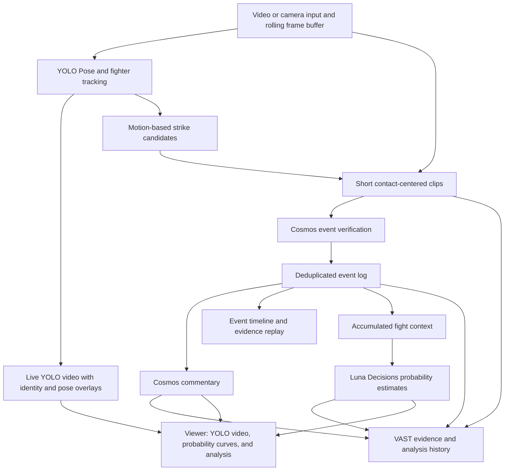

# FightLens

**Who is more likely to win—and what just changed?**

FightLens is a real-time MMA viewing agent being built to recognize fight actions, generate commentary, and update estimated win probabilities as a match unfolds. The goal is to connect every update to the exchanges viewers can see and replay.

Built for the Real-Time Video Agents Hack — NYC, October 9, 2026.

## Local web application

The Next.js application uses React, TypeScript, shadcn/ui, Recharts, and LiveKit. A desktop or paired phone publishes a camera track to the viewer and Python diagnostic receiver. The live UI reports receiver frames and leaves numeric momentum unavailable. The separate Demo/local-file mode uses a simulated momentum curve. Cosmos exchange review exists in `cosmos_branch/` as a standalone Python pipeline; it is not yet connected to the web application.

For local review, run `pnpm install --frozen-lockfile`, `pnpm live:setup`, and `pnpm live:dev`, then open `http://localhost:4173`. See [live setup and deployment boundaries](docs/LIVE_SETUP.md), [the web MVP guide](docs/WEB_MVP.md), and [local transport verification](docs/LIVE_VERIFICATION.md). Physical-phone and TURN acceptance remain outstanding. The earlier Chrome prototype remains in [extension/](extension/README.md).

## Why FightLens

During a fast exchange, a viewer has only a moment to decide: did that punch land, was it blocked, and who now has the advantage?

FightLens brings those questions into one viewing experience: the fight, the detected actions, an explanation of the exchange, and an evolving estimate of who is more likely to win. Its agent loop continuously observes incoming footage, maintains fight context, and revises its assessment as new evidence arrives.

## The demo we are building

The three-minute hackathon demo follows one visible change in the fight:

1. **Watch.** Feed in MMA footage and track both fighters with identity and pose overlays.
2. **Understand.** Detect an attack candidate and review whether it landed, was blocked, or missed. Keep ambiguous contact unknown.
3. **Explain.** Generate commentary and analysis describing the exchange and the observed shift in fight momentum.
4. **Estimate.** Update the fighters' estimated win probabilities and plot them over time alongside the YOLO video and analysis.
5. **Replay.** Return to the relevant video evidence to inspect the exchange behind the update.

The key demo moment is an exchange appearing in the YOLO video, followed by matching analysis and a visible change in the probability curves. All three views share the same fight timeline so viewers can follow what the system observed and how its assessment evolved.

### Viewer layout

| View | What the audience sees |
| --- | --- |
| **Win-probability curves** | A curve for each fighter, with fight time on the horizontal axis and estimated win probability on the vertical axis. Timestamped exchange markers connect updates to video evidence. |
| **Real-time YOLO video** | Fight footage with stable A/B identities, pose overlays, and attack-candidate indicators as frames arrive. |
| **Commentary and analysis** | Timestamped descriptions of observed exchanges and an interpretation of the evolving fight state, with links back to the relevant footage. |

Selecting an exchange marker returns the video and analysis to that point in the fight. The curves show estimates made from evidence available at each timestamp.

Planned inputs include prerecorded footage and live capture from a computer or phone camera. The first engineering milestone uses prerecorded footage; camera capture is a planned extension.

## How it works

The proposed architecture gives each component a distinct job:

| Component | Role in FightLens |
| --- | --- |
| **Ultralytics YOLO Pose + tracking** | Track fighter identity and pose; use limb motion to propose attack candidates. |
| **NVIDIA Cosmos** | Review short exchanges, verify contact outcomes, and generate commentary grounded in the observed events. |
| **VAST** | Organize video evidence and associated event, commentary, and prediction records into a retrievable fight history. |
| **OpenAI Luna Decisions** | Evaluate current evidence and accumulated context to produce prototype win-probability estimates. |

The repository includes initial YOLO tracking and exchange-analysis scripts, plus smoke-test scripts that send per-second frames to Cosmos and to Luna Decisions (see below). VAST integration remains planned; endpoint access, model versions, end-to-end latency, and application-level accuracy still need validation. Weights & Biases / Weave is also planned for experiment and model-call tracing.



OpenAI's [Decisions API](https://developers.openai.com/api/docs/guides/decisions) supports text and image evidence and typed probability, choice, and score answers with `gpt-6-luna`. FightLens proposes using that capability for probability estimation; validating and calibrating those estimates against historical fight outcomes is a separate research task.

The [initial pipeline and validation plan](docs/PIPELINE.md) covers the first engineering milestone: tracking, contact verification, heatmaps, and evidence replay on a short standing exchange. Commentary, probability estimation, camera capture, and VAST integration extend that initial plan. The version `0.1` contract below covers tracking and strike events; interfaces for these additional components still need to be defined before integration.

## From demo to product

FightLens starts with a viewing experience and could grow into an analysis service for both professional events and everyday training.

| Potential customer | Product value | Proposed business model |
| --- | --- | --- |
| **Event organizers and streaming platforms** | Embed live action analysis, commentary, and fight trends into the viewing experience. | Per-event licensing, video-processing usage, or SDK/API licensing. |
| **Gyms and coaches** | Turn phone-recorded training sessions into attack statistics and searchable evidence replay. | Coach or gym subscriptions. |
| **Sports media and creators** | Find notable exchanges and build analysis around timestamped video evidence. | Subscription tools or API usage. |

The longer-term opportunity is a reusable analysis layer for combat sports. An authorized, labeled, and evaluated dataset linking footage, events, and model assessments could support better validation and expansion into additional disciplines.

## Current repository status

This checkout contains the project design, module interface contract, fictional sample data, earlier scripted visual assets, and [YOLO tracking and exchange-analysis scripts](yolo_branch/README.md). Those scripts feed the [arcade replay demo](examples/arcade/README.md), which plays recorded footage with precomputed motion signals. [Cosmos per-second scene understanding](#cosmos-per-second-video-understanding-smoke-test) and [Luna Decisions win probabilities](#openrouter-per-second-win-probability-demo) exist as smoke-test scripts. The Next.js camera transport and Python diagnostic receiver are implemented separately from these analysis scripts. The synchronized win-probability curves, live YOLO inference, Cosmos captions in the web viewer, and VAST integration remain planned; physical-phone camera acceptance remains outstanding. The product experience above describes the target demo; end-to-end validation remains outstanding.

### First engineering milestone

Use a 30–60 second standing-exchange video with both fighters clearly visible to evaluate stable A/B identity, attack direction, contact region, landed/blocked/missed/unknown outcomes, and end-to-end latency at the video's original playback speed.

Validate the video, tracking overlays, timestamped events, and evidence replay first. That evidence pipeline will support the target viewer: synchronized win-probability curves, real-time YOLO video, and commentary and analysis, followed by camera input.

See [the product requirements](docs/PRD.md) for the Next.js camera/WebRTC workflow, linked momentum and heatmaps, Jev judgments, and validation requirements. That document currently defines a momentum-based scope without win-probability prediction; this README proposes the expanded probability-curve demo described above.

## Repository layout

Each module has one owner and only that owner edits it. Modules talk to each other **only** through the JSON files defined in [Event JSON contract](#event-json-contract) below.

```
fightlens/
  README.md        Project story and Event JSON contract
  yolo_branch/     YOLO Pose + tracking → tracks.jsonl, candidates.jsonl
  video_branch/    Clip-level video-model verification (Cosmos) → verdicts.jsonl
  fusion/          Merge candidates + verdicts → events.json (deduplicated ledger)
  frontend/        Planned viewer: probability curves, YOLO video, analysis, replay
  scripts/         Cosmos per-second scene understanding and Luna win-probability smoke tests
  tests/           Unit tests for scripts/
  examples/        Arcade replay demo, contract sample files, earlier scripted visual assets
  docs/            Pipeline and validation plan
  data/            Local only (git-ignored): source videos
  outputs/         Local only (git-ignored): every module writes here
```

To change the contract, edit this README in its own pull request and tell everyone before merging.

## Source videos

Videos stay out of Git. Download them into `data/raw/` with the file names below.

| Clip ID | File | Resolution / FPS | Duration | Source |
| --- | --- | --- | --- | --- |
| `pereira_rountree_45s` | `data/raw/pereira_rountree_45s.mp4` | 1280×720 @ 29.97 | 45.0 s | [Google Drive](https://drive.google.com/file/d/1ZYQb6Tkuo2TITshzHH5iBiWmd1JdI4wi/view?usp=drive_link) |
| `holloway_gaethje_20s` | `data/raw/holloway_gaethje_20s.mp4` | 1920×1080 @ 30 | 20.0 s | [Google Drive](https://drive.google.com/file/d/1Bk4hWw3OVDl0QXcBAqfl3GBR5jHwYYjW/view?usp=drive_link) |

```bash
mkdir -p data/raw
curl -L -o data/raw/pereira_rountree_45s.mp4 "https://drive.usercontent.google.com/download?id=1ZYQb6Tkuo2TITshzHH5iBiWmd1JdI4wi&export=download&confirm=t"
curl -L -o data/raw/holloway_gaethje_20s.mp4 "https://drive.usercontent.google.com/download?id=1Bk4hWw3OVDl0QXcBAqfl3GBR5jHwYYjW&export=download&confirm=t"
```

## Event JSON contract

Version `0.1`. Sample files for every format live in [`examples/contract/`](examples/contract/); they are fictional and contain no observed results.

### Conventions (all files)

- `clip_id`: file stem of the source video, e.g. `pereira_rountree_45s`.
- `t_s`: seconds on the **source video timeline** (presentation time), float, 3 decimals. `frame_idx`: 0-based frame index in the source video. Never use wall-clock time for these.
- Fighters are always `"A"` and `"B"`. The mapping from tracker IDs to A/B is fixed by `yolo_branch` and must not depend on screen side. The referee is never A or B.
- Pixel coordinates are in source-video pixels, origin top-left, boxes as `[x1, y1, x2, y2]`.
- Keypoints use the COCO-17 order that YOLO Pose outputs, each as `[x, y, conf]`.
- Enums (lower-case strings):
  - `limb`: `left_hand`, `right_hand`, `left_foot`, `right_foot`, `left_knee`, `right_knee`, `other`
  - `zone`: `head`, `body`, `leg`
  - `outcome`: `landed`, `blocked`, `missed`, `unknown`, `not_strike` (definitions in [PIPELINE.md §3](docs/PIPELINE.md#3-asynchronous-verification))
- Any field may be `null` when unknown. Do not guess to fill a field.
- Every record carries `"schema_version": "0.1"`. JSONL = one JSON object per line, appended in time order.
- Outputs go to `outputs/<clip_id>/<file>`.

### 1. `tracks.jsonl` — producer: `yolo_branch`, consumers: `frontend`, `fusion`, `video_branch`

One line per processed frame.

```json
{"schema_version": "0.1", "clip_id": "pereira_rountree_45s", "frame_idx": 373, "t_s": 12.446,
 "identity_status": "stable",
 "fighters": {
   "A": {"track_id": 3, "bbox": [412.0, 120.5, 640.2, 700.0], "conf": 0.91, "kpts": [[520.1, 160.3, 0.98], "... 17 total"]},
   "B": {"track_id": 7, "bbox": [700.0, 110.0, 930.0, 705.0], "conf": 0.88, "kpts": [[810.4, 150.2, 0.97], "... 17 total"]}
 }}
```

- `identity_status`: `stable` | `uncertain` | `lost`. When not `stable`, downstream must not attribute new events.
- A fighter that is not visible is `null`.

### 2. `candidates.jsonl` — producer: `yolo_branch`, consumers: `video_branch`, `fusion`

One line per proposed attack. A candidate is a motion hypothesis, not evidence of contact.

```json
{"schema_version": "0.1", "clip_id": "pereira_rountree_45s", "event_id": "c0017",
 "t_s": 12.430, "frame_idx": 372, "attacker": "A", "defender": "B",
 "limb": "right_hand", "zone_guess": "head", "window_s": [11.830, 12.730],
 "score": 0.74, "emitted_at_s": 12.731}
```

- `event_id`: `c` + 4 digits, unique per clip, never reused. Every later stage keys on it.
- `window_s`: clip to verify; default `[t_s - 0.6, t_s + 0.3]`.
- `score`: heuristic strength from the candidate generator, not a probability.
- `emitted_at_s`: source-video time at which the candidate was emitted (for latency measurement).

### 3. `verdicts.jsonl` — producer: `video_branch`, consumer: `fusion`

One line per verification result.

```json
{"schema_version": "0.1", "clip_id": "pereira_rountree_45s", "event_id": "c0017",
 "outcome": "landed", "contact_zone": "head", "attacker": "A", "defender": "B", "limb": "right_hand",
 "evidence_times_s": [12.400, 12.433, 12.467], "uncertainty_reason": null,
 "model": "cosmos-reason2-<version>", "request_ms": 1840, "raw_response": "..."}
```

- `event_id` matches a candidate. If the video model proposes an attack on its own, use a new ID `v` + 4 digits.
- `attacker` / `defender` / `limb` may correct the candidate's values, or be `null` to keep them.
- `uncertainty_reason` (required when `outcome` is `unknown`): `occluded`, `blur`, `identity_uncertain`, `depth_ambiguous`, `timeout`, `other`.
- `raw_response`: keep the unparsed model output for debugging.

### 4. `events.json` — producer: `fusion`, consumer: `frontend`

The single deduplicated ledger the viewer renders. Rewritten as a whole file on every update.

```json
{
  "schema_version": "0.1",
  "clip_id": "pereira_rountree_45s",
  "video": {"path": "data/raw/pereira_rountree_45s.mp4", "fps": 29.97, "width": 1280, "height": 720, "duration_s": 45.012},
  "fighters": {"A": {"name": null, "color": "#e5484d"}, "B": {"name": null, "color": "#3e63dd"}},
  "updated_at_s": 13.900,
  "events": [
    {"event_id": "c0017", "t_s": 12.430, "attacker": "A", "defender": "B", "limb": "right_hand",
     "outcome": "landed", "contact_zone": "head", "evidence_times_s": [12.400, 12.433, 12.467],
     "status": "accepted", "revision": 1, "sources": ["yolo", "video"], "uncertainty_reason": null}
  ]
}
```

- `status`: `pending` (candidate without verdict), `accepted`, `withdrawn` (later evidence or `not_strike`). Withdrawn events stay in the list.
- `revision` increases every time an event changes. The frontend replaces events by `event_id`.
- Heatmap rule: count an event once for the defender's `contact_zone` only when `status == "accepted"` and `outcome == "landed"`. `blocked` is counted separately. The frontend computes totals from `events`; there is no separate totals field.

## Scope and evidence

- A heatmap represents detected received strikes, not a medical injury assessment or impact-force measurement.
- A blocked strike is recorded separately from a direct hit to the intended body region.
- Unclear contact stays unknown rather than being forced into a binary answer.
- Prototype win-probability estimates require historical evaluation and calibration before their predictive accuracy can be claimed. No validated win-probability model is included.
- Single-clip results will establish limited feasibility, not general reliability across MMA broadcasts.

## Cosmos per-second video understanding smoke test

`scripts/cosmos_video_understanding.py` implements the first end-to-end model path:

1. Split the input into complete one-second windows.
2. Sample five ordered JPEG frames at `+0.1`, `+0.3`, `+0.5`, `+0.7`, and `+0.9` seconds.
3. Send the fixed UFC scene-observer system prompt and one Cosmos3 Reason request per
   source-video second using NVIDIA NIM's temporal `video_frames` input.
4. Pass the previous successful second's complete scene JSON back as `previous_state`.
5. Append the structured scene result, raw model text, latency, usage, and any error to JSONL.

Run this inside the VAST Builders Challenge workshop VM, or locally after securely exporting
the Team bearer token. The VM's single `/config/<team>.config` contains
`GPU_BEARER_TOKEN`; the script reads that file without printing its values. It defaults to the
workshop Cosmos endpoint `http://166.19.38.112:8001`. `--api-base`,
`COSMOS3_REASON_URL`, or `COSMOS_API_BASE` can override that endpoint. Do not copy the bearer
token into source control. The workshop endpoint uses plain HTTP, so local calls expose the
bearer token and video frames to the network path; use it only from a trusted network.

First check local sampling without contacting Cosmos:

```sh
python3 scripts/cosmos_video_understanding.py \
  videos/pereira_rountree_45s.mp4 \
  --max-windows 1 \
  --dry-run
```

Then verify the workshop endpoint and discover its current model ID:

```sh
python3 scripts/cosmos_video_understanding.py --check
```

Run a single one-second inference before increasing the request count:

```sh
python3 scripts/cosmos_video_understanding.py \
  /path/to/permitted-test-video.mp4 \
  --fighter-map '{"A":"fixed identity or appearance","B":"fixed identity or appearance"}' \
  --max-windows 1
```

`--fighter-map` accepts inline JSON or `@/path/to/fighters.json`. It must contain exactly
the keys `A` and `B`; each value may be a non-empty string or JSON object. It is required for
inference so the model cannot silently reassign A/B based on screen position. The first
analyzed window receives `previous_state: null`; each later window receives the complete scene
JSON from the immediately preceding successful window.

Results default to `runs/cosmos/<video-stem>.jsonl`. Re-running resumes the file and skips only
the contiguous successful prefix whose video, model, fixed system prompt, fighter map, and
sampling configuration match the current run. This preserves the `previous_state` chain. Pass
`--overwrite` to start over. Non-JSON model output is stored as `invalid_response` and is retried
on a later run.
`--realtime` paces request starts at one per source second when inference latency allows it.
Shared workshop GPUs may take longer than one second or return `429`; the client runs serially
and retries `429`, `5xx`, timeouts, and transient connection failures with backoff.
The client validates the fixed JSON schema and stops at the first failed window so it never
feeds a non-adjacent or malformed state into the next second.
Each successful one-second scene is also emitted immediately as one compact JSON line on
standard output; progress and errors stay on standard error, while the full records continue
to be persisted in the JSONL output file.

The default `--media-mode auto` uses `video_frames`. If the workshop wrapper rejects that
NIM 1.7 input type, the same five frames are encoded as a one-second 5 FPS MP4 and retried as
`video_url` with `num_frames=5`.

For a local non-workshop NIM, copy `.env.example` to `.env` and fill the endpoint credentials.
Never commit `.env`. Run tests with:

```sh
python3 -m unittest discover -s tests -v
```

## OpenRouter per-second win-probability demo

`scripts/openrouter_win_probability.py` reuses the same sampling path, sends five ordered
frames for each complete video second to OpenRouter's Decisions API, and asks
`openai/gpt-6-luna-decisions` for a typed A/B choice. The two values in
`answers.winner.probabilities` are used directly, so this path does not ask a chat model to
invent or format a probability JSON response. The previous successful result is included as
context for the next source-video second.

Keep the API key in the current shell, never in a command saved to the repository:

```sh
export OPENROUTER_API_KEY='replace-with-your-openrouter-key'
```

Alternatively, copy `.env.example` to the ignored `.env` file and set
`OPENROUTER_API_KEY` there; the script loads that local file automatically.

Run a three-second local demo:

```sh
python3 scripts/openrouter_win_probability.py \
  videos/pereira_rountree_45s.mp4 \
  --fighter-map '{"A":{"name":"Alex Pereira"},"B":{"name":"Khalil Rountree Jr."}}' \
  --max-windows 3 \
  --realtime \
  --output runs/openrouter/pereira_demo_3s.jsonl \
  --overwrite
```

Each successful second is printed immediately as one compact JSON line. Detailed records,
including source timestamps, latency, usage, and prompt hash, are appended to the output
JSONL; API keys and encoded frames are not persisted. To replace the probability rubric, use
`--prompt '...'` or `--prompt-file /path/to/prompt.txt`. The built-in rubric considers only
visible offense, control, takedown/get-up results, submission threats, defense, and visible
clock context, while excluding fame, records, odds, known results, and invisible conditions.

`--realtime` prevents a fast request from starting before its source second is due. Requests
remain serial so `previous_state` stays contiguous; if a model call takes longer than one
second, this smoke-test path cannot maintain one wall-clock request per second. These outputs
are uncalibrated model estimates. A famous archived fight with real names can also leak the
known result through model memory, so use unseen footage or identity-neutral appearance
descriptions when evaluating whether probabilities come only from visual evidence.

## References

- [Hackathon page](https://tokensand.com/vastnyc)
- [Ultralytics YOLO11](https://docs.ultralytics.com/models/yolo11/)
- [Ultralytics tracking](https://docs.ultralytics.com/modes/track/)
- [Cosmos 3 Reasoner NIM 1.7 API](https://docs.nvidia.com/nim/vision-language-models/1.7.0/examples/cosmos-reason3/api.html)
- [TapStats product preview](https://www.tapstats.live/app-tour) — a reference for spectator interaction; its preview describes manual crowd-sourced strike input.
