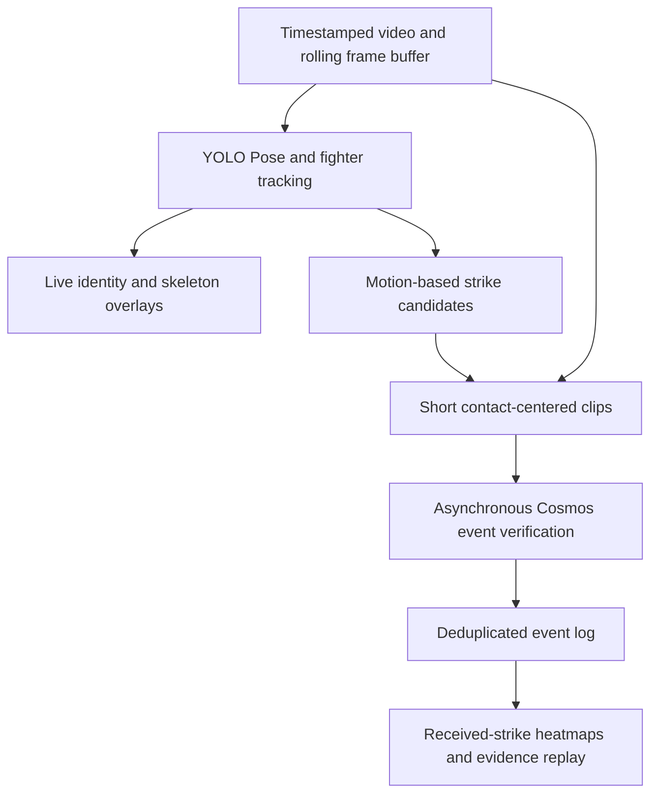

# FightLens

A real-time MMA viewing assistant that shows who struck whom, where contact occurred, and how the exchange unfolded.

Built for the Real-Time Video Agents Hack — NYC, October 9, 2026.

**Status: project planning.** This repository currently contains the project brief and pipeline design. There is no working application, trained strike classifier, or measured performance result yet.

## First milestone

Use a 30–60 second standing-exchange video with both fighters clearly visible to evaluate:

- Stable fighter identity: A and B remain correctly assigned throughout the clip.
- Attack direction: who attacked whom.
- Contact location: head, torso, or leg.
- Outcome: landed, blocked, missed, unknown, or not a strike.
- End-to-end latency when frames are processed at the video's original playback speed.

The planned viewer interface combines the video, fighter tracking overlays, received-strike heatmaps, and a timestamped event list with evidence replay.

## Proposed pipeline



See [the pipeline and validation plan](docs/PIPELINE.md) for model choices, event definitions, latency budgets, and acceptance criteria.

See [the product requirements](docs/PRD.md) for the Next.js camera/WebRTC workflow, linked momentum and heatmaps, Jev judgments, and validation requirements.

## Repository layout

Each module has one owner and only that owner edits it. Modules talk to each other **only** through the JSON files defined in [Event JSON contract](#event-json-contract) below.

```
fightlens/
  README.md        Event JSON contract — the team's single shared interface
  yolo_branch/     YOLO Pose + tracking → tracks.jsonl, candidates.jsonl
  video_branch/    Clip-level video-model verification (Cosmos) → verdicts.jsonl
  fusion/          Merge candidates + verdicts → events.json (deduplicated ledger)
  frontend/        Viewer: video, A/B overlays, heatmaps, event list, replay
  examples/        Scripted mock demo + contract sample files (examples/contract/)
  docs/            Pipeline and validation plan
  data/            Local only (git-ignored): source videos
  outputs/         Local only (git-ignored): every module writes here
```

To change the contract, edit this README in its own pull request and tell everyone before merging.

## Source videos

Videos stay out of Git. Download them into `data/raw/` with the file names below.

| Clip ID | File | Resolution / FPS | Duration | Source |
| --- | --- | --- | --- | --- |
| `pereira_rountree_45s` | `data/raw/pereira_rountree_45s.mp4` | 1280×720 @ 29.97 | 45.0 s | [Google Drive](https://drive.google.com/file/d/1ZYQb6Tkuo2TITshzHH5iBiWmd1JdI4wi/view?usp=drive_link) |
| `holloway_gaethje_20s` | `data/raw/holloway_gaethje_20s.mp4` | 1920×1080 @ 30 | 20.0 s | [Google Drive](https://drive.google.com/file/d/1Bk4hWw3OVDl0QXcBAqfl3GBR5jHwYYjW/view?usp=drive_link) |

```bash
mkdir -p data/raw
curl -L -o data/raw/pereira_rountree_45s.mp4 "https://drive.usercontent.google.com/download?id=1ZYQb6Tkuo2TITshzHH5iBiWmd1JdI4wi&export=download&confirm=t"
curl -L -o data/raw/holloway_gaethje_20s.mp4 "https://drive.usercontent.google.com/download?id=1Bk4hWw3OVDl0QXcBAqfl3GBR5jHwYYjW&export=download&confirm=t"
```

## Event JSON contract

Version `0.1`. Sample files for every format live in [`examples/contract/`](examples/contract/); they are fictional and contain no observed results.

### Conventions (all files)

- `clip_id`: file stem of the source video, e.g. `pereira_rountree_45s`.
- `t_s`: seconds on the **source video timeline** (presentation time), float, 3 decimals. `frame_idx`: 0-based frame index in the source video. Never use wall-clock time for these.
- Fighters are always `"A"` and `"B"`. The mapping from tracker IDs to A/B is fixed by `yolo_branch` and must not depend on screen side. The referee is never A or B.
- Pixel coordinates are in source-video pixels, origin top-left, boxes as `[x1, y1, x2, y2]`.
- Keypoints use the COCO-17 order that YOLO Pose outputs, each as `[x, y, conf]`.
- Enums (lower-case strings):
  - `limb`: `left_hand`, `right_hand`, `left_foot`, `right_foot`, `left_knee`, `right_knee`, `other`
  - `zone`: `head`, `body`, `leg`
  - `outcome`: `landed`, `blocked`, `missed`, `unknown`, `not_strike` (definitions in [PIPELINE.md §3](docs/PIPELINE.md#3-asynchronous-verification))
- Any field may be `null` when unknown. Do not guess to fill a field.
- Every record carries `"schema_version": "0.1"`. JSONL = one JSON object per line, appended in time order.
- Outputs go to `outputs/<clip_id>/<file>`.

### 1. `tracks.jsonl` — producer: `yolo_branch`, consumers: `frontend`, `fusion`, `video_branch`

One line per processed frame.

```json
{"schema_version": "0.1", "clip_id": "pereira_rountree_45s", "frame_idx": 373, "t_s": 12.446,
 "identity_status": "stable",
 "fighters": {
   "A": {"track_id": 3, "bbox": [412.0, 120.5, 640.2, 700.0], "conf": 0.91, "kpts": [[520.1, 160.3, 0.98], "... 17 total"]},
   "B": {"track_id": 7, "bbox": [700.0, 110.0, 930.0, 705.0], "conf": 0.88, "kpts": [[810.4, 150.2, 0.97], "... 17 total"]}
 }}
```

- `identity_status`: `stable` | `uncertain` | `lost`. When not `stable`, downstream must not attribute new events.
- A fighter that is not visible is `null`.

### 2. `candidates.jsonl` — producer: `yolo_branch`, consumers: `video_branch`, `fusion`

One line per proposed attack. A candidate is a motion hypothesis, not evidence of contact.

```json
{"schema_version": "0.1", "clip_id": "pereira_rountree_45s", "event_id": "c0017",
 "t_s": 12.430, "frame_idx": 372, "attacker": "A", "defender": "B",
 "limb": "right_hand", "zone_guess": "head", "window_s": [11.830, 12.730],
 "score": 0.74, "emitted_at_s": 12.731}
```

- `event_id`: `c` + 4 digits, unique per clip, never reused. Every later stage keys on it.
- `window_s`: clip to verify; default `[t_s - 0.6, t_s + 0.3]`.
- `score`: heuristic strength from the candidate generator, not a probability.
- `emitted_at_s`: source-video time at which the candidate was emitted (for latency measurement).

### 3. `verdicts.jsonl` — producer: `video_branch`, consumer: `fusion`

One line per verification result.

```json
{"schema_version": "0.1", "clip_id": "pereira_rountree_45s", "event_id": "c0017",
 "outcome": "landed", "contact_zone": "head", "attacker": "A", "defender": "B", "limb": "right_hand",
 "evidence_times_s": [12.400, 12.433, 12.467], "uncertainty_reason": null,
 "model": "cosmos-reason2-<version>", "request_ms": 1840, "raw_response": "..."}
```

- `event_id` matches a candidate. If the video model proposes an attack on its own, use a new ID `v` + 4 digits.
- `attacker` / `defender` / `limb` may correct the candidate's values, or be `null` to keep them.
- `uncertainty_reason` (required when `outcome` is `unknown`): `occluded`, `blur`, `identity_uncertain`, `depth_ambiguous`, `timeout`, `other`.
- `raw_response`: keep the unparsed model output for debugging.

### 4. `events.json` — producer: `fusion`, consumer: `frontend`

The single deduplicated ledger the viewer renders. Rewritten as a whole file on every update.

```json
{
  "schema_version": "0.1",
  "clip_id": "pereira_rountree_45s",
  "video": {"path": "data/raw/pereira_rountree_45s.mp4", "fps": 29.97, "width": 1280, "height": 720, "duration_s": 45.012},
  "fighters": {"A": {"name": null, "color": "#e5484d"}, "B": {"name": null, "color": "#3e63dd"}},
  "updated_at_s": 13.900,
  "events": [
    {"event_id": "c0017", "t_s": 12.430, "attacker": "A", "defender": "B", "limb": "right_hand",
     "outcome": "landed", "contact_zone": "head", "evidence_times_s": [12.400, 12.433, 12.467],
     "status": "accepted", "revision": 1, "sources": ["yolo", "video"], "uncertainty_reason": null}
  ]
}
```

- `status`: `pending` (candidate without verdict), `accepted`, `withdrawn` (later evidence or `not_strike`). Withdrawn events stay in the list.
- `revision` increases every time an event changes. The frontend replaces events by `event_id`.
- Heatmap rule: count an event once for the defender's `contact_zone` only when `status == "accepted"` and `outcome == "landed"`. `blocked` is counted separately. The frontend computes totals from `events`; there is no separate totals field.

## Planned tools

| Tool | Proposed role | Status |
| --- | --- | --- |
| Ultralytics YOLO Pose + ByteTrack / BoT-SORT | Fighter tracking, pose estimation, and candidate generation | Planned |
| NVIDIA Cosmos video-understanding endpoint | Review short candidate clips | Planned; event endpoint and model version to confirm |
| VAST | Store video evidence and event metadata | Planned; access to confirm |
| Weights & Biases / Weave | Record experiments, model calls, and latency | Planned; access to confirm |

These entries describe intended integrations, not completed integrations or confirmed sponsor eligibility.

## Scope and evidence

- A heatmap represents detected received strikes, not a medical injury assessment or impact-force measurement.
- A blocked strike is recorded separately from a direct hit to the intended body region.
- Unclear contact stays unknown rather than being forced into a binary answer.
- Win-probability prediction is a later research task requiring historical evaluation and calibration. No validated win-probability model is included.
- Single-clip results will establish limited feasibility, not general reliability across MMA broadcasts.

## Next actions

- [x] Select test videos and keep them outside Git (see [Source videos](#source-videos)).
- [x] Define the module layout and event JSON contract.
- [ ] Annotate attacks, outcomes, body regions, and uncertain events.
- [ ] Run pose and identity tracking on the first 10 seconds.
- [ ] Add candidate generation and event deduplication.
- [ ] Benchmark the available Cosmos endpoint on short clips.
- [ ] Compare geometry-only and Cosmos-assisted decisions on held-out footage.
- [ ] Build the heatmap, event list, and evidence replay interface.
- [ ] Record a three-minute project demo and make the repository accessible to reviewers.

## Cosmos per-second video understanding smoke test

`scripts/cosmos_video_understanding.py` implements the first end-to-end model path:

1. Split the input into complete one-second windows.
2. Sample five ordered JPEG frames at `+0.1`, `+0.3`, `+0.5`, `+0.7`, and `+0.9` seconds.
3. Send the fixed UFC scene-observer system prompt and one Cosmos3 Reason request per
   source-video second using NVIDIA NIM's temporal `video_frames` input.
4. Pass the previous successful second's complete scene JSON back as `previous_state`.
5. Append the structured scene result, raw model text, latency, usage, and any error to JSONL.

Run this inside the VAST Builders Challenge workshop VM, or locally after securely exporting
the Team bearer token. The VM's single `/config/<team>.config` contains
`GPU_BEARER_TOKEN`; the script reads that file without printing its values. It defaults to the
workshop Cosmos endpoint `http://166.19.38.112:8001`. `--api-base`,
`COSMOS3_REASON_URL`, or `COSMOS_API_BASE` can override that endpoint. Do not copy the bearer
token into source control. The workshop endpoint uses plain HTTP, so local calls expose the
bearer token and video frames to the network path; use it only from a trusted network.

First check local sampling without contacting Cosmos:

```sh
python3 scripts/cosmos_video_understanding.py \
  videos/pereira_rountree_45s.mp4 \
  --max-windows 1 \
  --dry-run
```

Then verify the workshop endpoint and discover its current model ID:

```sh
python3 scripts/cosmos_video_understanding.py --check
```

Run a single one-second inference before increasing the request count:

```sh
python3 scripts/cosmos_video_understanding.py \
  /path/to/permitted-test-video.mp4 \
  --fighter-map '{"A":"fixed identity or appearance","B":"fixed identity or appearance"}' \
  --max-windows 1
```

`--fighter-map` accepts inline JSON or `@/path/to/fighters.json`. It must contain exactly
the keys `A` and `B`; each value may be a non-empty string or JSON object. It is required for
inference so the model cannot silently reassign A/B based on screen position. The first
analyzed window receives `previous_state: null`; each later window receives the complete scene
JSON from the immediately preceding successful window.

Results default to `runs/cosmos/<video-stem>.jsonl`. Re-running resumes the file and skips only
the contiguous successful prefix whose video, model, fixed system prompt, fighter map, and
sampling configuration match the current run. This preserves the `previous_state` chain. Pass
`--overwrite` to start over. Non-JSON model output is stored as `invalid_response` and is retried
on a later run.
`--realtime` paces request starts at one per source second when inference latency allows it.
Shared workshop GPUs may take longer than one second or return `429`; the client runs serially
and retries `429`, `5xx`, timeouts, and transient connection failures with backoff.
The client validates the fixed JSON schema and stops at the first failed window so it never
feeds a non-adjacent or malformed state into the next second.
Each successful one-second scene is also emitted immediately as one compact JSON line on
standard output; progress and errors stay on standard error, while the full records continue
to be persisted in the JSONL output file.

The default `--media-mode auto` uses `video_frames`. If the workshop wrapper rejects that
NIM 1.7 input type, the same five frames are encoded as a one-second 5 FPS MP4 and retried as
`video_url` with `num_frames=5`.

For a local non-workshop NIM, copy `.env.example` to `.env` and fill the endpoint credentials.
Never commit `.env`. Run tests with:

```sh
python3 -m unittest discover -s tests -v
```

## OpenRouter per-second win-probability demo

`scripts/openrouter_win_probability.py` reuses the same sampling path, sends five ordered
frames for each complete video second to OpenRouter's Decisions API, and asks
`openai/gpt-6-luna-decisions` for a typed A/B choice. The two values in
`answers.winner.probabilities` are used directly, so this path does not ask a chat model to
invent or format a probability JSON response. The previous successful result is included as
context for the next source-video second.

Keep the API key in the current shell, never in a command saved to the repository:

```sh
export OPENROUTER_API_KEY='replace-with-your-openrouter-key'
```

Alternatively, copy `.env.example` to the ignored `.env` file and set
`OPENROUTER_API_KEY` there; the script loads that local file automatically.

Run a three-second local demo:

```sh
python3 scripts/openrouter_win_probability.py \
  videos/pereira_rountree_45s.mp4 \
  --fighter-map '{"A":{"name":"Alex Pereira"},"B":{"name":"Khalil Rountree Jr."}}' \
  --max-windows 3 \
  --realtime \
  --output runs/openrouter/pereira_demo_3s.jsonl \
  --overwrite
```

Each successful second is printed immediately as one compact JSON line. Detailed records,
including source timestamps, latency, usage, and prompt hash, are appended to the output
JSONL; API keys and encoded frames are not persisted. To replace the probability rubric, use
`--prompt '...'` or `--prompt-file /path/to/prompt.txt`. The built-in rubric considers only
visible offense, control, takedown/get-up results, submission threats, defense, and visible
clock context, while excluding fame, records, odds, known results, and invisible conditions.

`--realtime` prevents a fast request from starting before its source second is due. Requests
remain serial so `previous_state` stays contiguous; if a model call takes longer than one
second, this smoke-test path cannot maintain one wall-clock request per second. These outputs
are uncalibrated model estimates. A famous archived fight with real names can also leak the
known result through model memory, so use unseen footage or identity-neutral appearance
descriptions when evaluating whether probabilities come only from visual evidence.

## References

- [Hackathon page](https://tokensand.com/vastnyc)
- [Ultralytics YOLO11](https://docs.ultralytics.com/models/yolo11/)
- [Ultralytics tracking](https://docs.ultralytics.com/modes/track/)
- [Cosmos 3 Reasoner NIM 1.7 API](https://docs.nvidia.com/nim/vision-language-models/1.7.0/examples/cosmos-reason3/api.html)
- [TapStats product preview](https://www.tapstats.live/app-tour) — a reference for spectator interaction; its preview describes manual crowd-sourced strike input.
