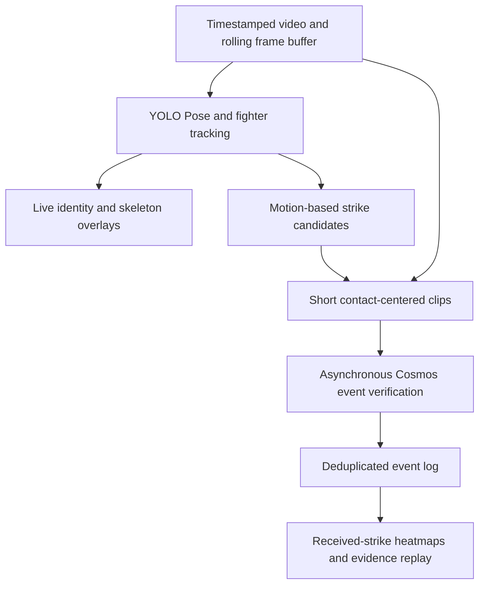

# FightLens

A real-time MMA viewing assistant that shows who struck whom, where contact occurred, and how the exchange unfolded.

Built for the Real-Time Video Agents Hack — NYC, October 9, 2026.

**Status: project planning.** This repository currently contains the project brief and pipeline design. There is no working application, trained strike classifier, or measured performance result yet.

## First milestone

Use a 30–60 second standing-exchange video with both fighters clearly visible to evaluate:

- Stable fighter identity: A and B remain correctly assigned throughout the clip.
- Attack direction: who attacked whom.
- Contact location: head, torso, or leg.
- Outcome: landed, blocked, missed, unknown, or not a strike.
- End-to-end latency when frames are processed at the video's original playback speed.

The planned viewer interface combines the video, fighter tracking overlays, received-strike heatmaps, and a timestamped event list with evidence replay.

## Proposed pipeline

See [the pipeline and validation plan](docs/PIPELINE.md) for model choices, event definitions, latency budgets, and acceptance criteria.

See [the product requirements](docs/PRD.md) for the proposed exchange-impact classification, Jev context contract, and subsequent market-response observation experiment.

## Planned tools

| Tool | Proposed role | Status |
| --- | --- | --- |
| Ultralytics YOLO Pose + ByteTrack / BoT-SORT | Fighter tracking, pose estimation, and candidate generation | Planned |
| NVIDIA Cosmos video-understanding endpoint | Review short candidate clips | Planned; event endpoint and model version to confirm |
| VAST | Store video evidence and event metadata | Planned; access to confirm |
| Weights & Biases / Weave | Record experiments, model calls, and latency | Planned; access to confirm |

These entries describe intended integrations, not completed integrations or confirmed sponsor eligibility.

## Scope and evidence

- A heatmap represents detected received strikes, not a medical injury assessment or impact-force measurement.
- A blocked strike is recorded separately from a direct hit to the intended body region.
- Unclear contact stays unknown rather than being forced into a binary answer.
- Win-probability prediction is a later research task requiring historical evaluation and calibration. No validated win-probability model is included.
- Single-clip results will establish limited feasibility, not general reliability across MMA broadcasts.

## Next actions

- [ ] Select a continuous 30–60 second test video and keep it outside Git.
- [ ] Annotate attacks, outcomes, body regions, and uncertain events.
- [ ] Run pose and identity tracking on the first 10 seconds.
- [ ] Add candidate generation and event deduplication.
- [ ] Benchmark the available Cosmos endpoint on short clips.
- [ ] Compare geometry-only and Cosmos-assisted decisions on held-out footage.
- [ ] Build the heatmap, event list, and evidence replay interface.
- [ ] Record a three-minute project demo and make the repository accessible to reviewers.

## References

- [Hackathon page](https://tokensand.com/vastnyc)
- [Ultralytics YOLO11](https://docs.ultralytics.com/models/yolo11/)
- [Ultralytics tracking](https://docs.ultralytics.com/modes/track/)
- [Cosmos Reason2 NIM API](https://docs.nvidia.com/nim/vision-language-models/1.6.0/examples/cosmos-reason2/api.html)
- [TapStats product preview](https://www.tapstats.live/app-tour) — a reference for spectator interaction; its preview describes manual crowd-sourced strike input.
