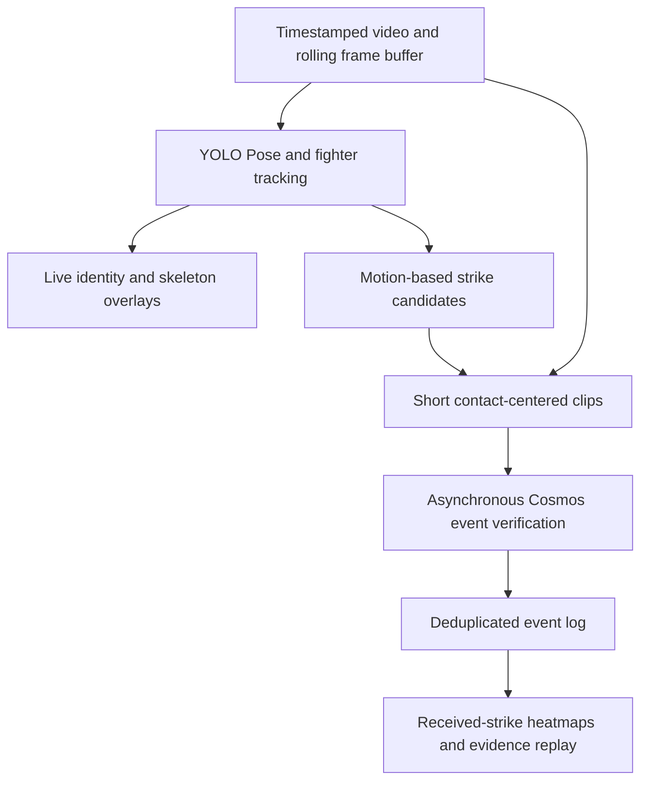

# FightLens

A real-time MMA viewing assistant that shows who struck whom, where contact occurred, and how the exchange unfolded.

Built for the Real-Time Video Agents Hack — NYC, October 9, 2026.

**Status: live camera transport and diagnostic receiver implemented; video analysis remains planned.** The Next.js application uses React, TypeScript, shadcn/ui, Recharts, and LiveKit. A desktop or paired phone publishes a camera track to the viewer and Python receiver. The live UI reports actual receiver frames and explicitly leaves numeric momentum unavailable. There is no connected strike classifier or measured inference performance result yet.

For the live MVP, run `pnpm install --frozen-lockfile`, `pnpm live:setup`, and `pnpm live:dev`, then open `http://localhost:4173`. See [live setup and deployment boundaries](docs/LIVE_SETUP.md) for prerequisites and phone access. [The web MVP guide](docs/WEB_MVP.md) covers the separate Demo/local-file mode. All Demo curve values are simulated. The earlier Chrome prototype remains in [extension/](extension/README.md) for reference.

## First milestone

Use a 30–60 second standing-exchange video with both fighters clearly visible to evaluate:

- Stable fighter identity: A and B remain correctly assigned throughout the clip.
- Attack direction: who attacked whom.
- Contact location: head, torso, or leg.
- Outcome: landed, blocked, missed, unknown, or not a strike.
- End-to-end latency when frames are processed at the video's original playback speed.

The web MVP implements the viewing interaction with a simulated momentum curve using shadcn/ui's Neutral theme. Fighter tracking overlays, received-strike heatmaps, and actual evidence replay remain planned.

## Proposed pipeline



See [the pipeline and validation plan](docs/PIPELINE.md) for model choices, event definitions, latency budgets, and acceptance criteria.

See [the product requirements](docs/PRD.md) for the Next.js camera/WebRTC workflow, linked momentum and heatmaps, Jev judgments, and validation requirements.

## Repository layout

Each module has one owner and only that owner edits it. Modules talk to each other **only** through the JSON files defined in [Event JSON contract](#event-json-contract) below.

```
fightlens/
  README.md        Event JSON contract — the team's single shared interface
  yolo_branch/     YOLO Pose + tracking → tracks.jsonl, candidates.jsonl
  video_branch/    Clip-level video-model verification (Cosmos) → verdicts.jsonl
  fusion/          Merge candidates + verdicts → events.json (deduplicated ledger)
  frontend/        Viewer: video, A/B overlays, heatmaps, event list, replay
  examples/        Scripted mock demo + contract sample files (examples/contract/)
  docs/            Pipeline and validation plan
  data/            Local only (git-ignored): source videos
  outputs/         Local only (git-ignored): every module writes here
```

To change the contract, edit this README in its own pull request and tell everyone before merging.

## Source videos

Videos stay out of Git. Download them into `data/raw/` with the file names below.

| Clip ID | File | Resolution / FPS | Duration | Source |
| --- | --- | --- | --- | --- |
| `pereira_rountree_45s` | `data/raw/pereira_rountree_45s.mp4` | 1280×720 @ 29.97 | 45.0 s | [Google Drive](https://drive.google.com/file/d/1ZYQb6Tkuo2TITshzHH5iBiWmd1JdI4wi/view?usp=drive_link) |
| `holloway_gaethje_20s` | `data/raw/holloway_gaethje_20s.mp4` | 1920×1080 @ 30 | 20.0 s | [Google Drive](https://drive.google.com/file/d/1Bk4hWw3OVDl0QXcBAqfl3GBR5jHwYYjW/view?usp=drive_link) |

```bash
mkdir -p data/raw
curl -L -o data/raw/pereira_rountree_45s.mp4 "https://drive.usercontent.google.com/download?id=1ZYQb6Tkuo2TITshzHH5iBiWmd1JdI4wi&export=download&confirm=t"
curl -L -o data/raw/holloway_gaethje_20s.mp4 "https://drive.usercontent.google.com/download?id=1Bk4hWw3OVDl0QXcBAqfl3GBR5jHwYYjW&export=download&confirm=t"
```

## Event JSON contract

Version `0.1`. Sample files for every format live in [`examples/contract/`](examples/contract/); they are fictional and contain no observed results.

### Conventions (all files)

- `clip_id`: file stem of the source video, e.g. `pereira_rountree_45s`.
- `t_s`: seconds on the **source video timeline** (presentation time), float, 3 decimals. `frame_idx`: 0-based frame index in the source video. Never use wall-clock time for these.
- Fighters are always `"A"` and `"B"`. The mapping from tracker IDs to A/B is fixed by `yolo_branch` and must not depend on screen side. The referee is never A or B.
- Pixel coordinates are in source-video pixels, origin top-left, boxes as `[x1, y1, x2, y2]`.
- Keypoints use the COCO-17 order that YOLO Pose outputs, each as `[x, y, conf]`.
- Enums (lower-case strings):
  - `limb`: `left_hand`, `right_hand`, `left_foot`, `right_foot`, `left_knee`, `right_knee`, `other`
  - `zone`: `head`, `body`, `leg`
  - `outcome`: `landed`, `blocked`, `missed`, `unknown`, `not_strike` (definitions in [PIPELINE.md §3](docs/PIPELINE.md#3-asynchronous-verification))
- Any field may be `null` when unknown. Do not guess to fill a field.
- Every record carries `"schema_version": "0.1"`. JSONL = one JSON object per line, appended in time order.
- Outputs go to `outputs/<clip_id>/<file>`.

### 1. `tracks.jsonl` — producer: `yolo_branch`, consumers: `frontend`, `fusion`, `video_branch`

One line per processed frame.

```json
{"schema_version": "0.1", "clip_id": "pereira_rountree_45s", "frame_idx": 373, "t_s": 12.446,
 "identity_status": "stable",
 "fighters": {
   "A": {"track_id": 3, "bbox": [412.0, 120.5, 640.2, 700.0], "conf": 0.91, "kpts": [[520.1, 160.3, 0.98], "... 17 total"]},
   "B": {"track_id": 7, "bbox": [700.0, 110.0, 930.0, 705.0], "conf": 0.88, "kpts": [[810.4, 150.2, 0.97], "... 17 total"]}
 }}
```

- `identity_status`: `stable` | `uncertain` | `lost`. When not `stable`, downstream must not attribute new events.
- A fighter that is not visible is `null`.

### 2. `candidates.jsonl` — producer: `yolo_branch`, consumers: `video_branch`, `fusion`

One line per proposed attack. A candidate is a motion hypothesis, not evidence of contact.

```json
{"schema_version": "0.1", "clip_id": "pereira_rountree_45s", "event_id": "c0017",
 "t_s": 12.430, "frame_idx": 372, "attacker": "A", "defender": "B",
 "limb": "right_hand", "zone_guess": "head", "window_s": [11.830, 12.730],
 "score": 0.74, "emitted_at_s": 12.731}
```

- `event_id`: `c` + 4 digits, unique per clip, never reused. Every later stage keys on it.
- `window_s`: clip to verify; default `[t_s - 0.6, t_s + 0.3]`.
- `score`: heuristic strength from the candidate generator, not a probability.
- `emitted_at_s`: source-video time at which the candidate was emitted (for latency measurement).

### 3. `verdicts.jsonl` — producer: `video_branch`, consumer: `fusion`

One line per verification result.

```json
{"schema_version": "0.1", "clip_id": "pereira_rountree_45s", "event_id": "c0017",
 "outcome": "landed", "contact_zone": "head", "attacker": "A", "defender": "B", "limb": "right_hand",
 "evidence_times_s": [12.400, 12.433, 12.467], "uncertainty_reason": null,
 "model": "cosmos-reason2-<version>", "request_ms": 1840, "raw_response": "..."}
```

- `event_id` matches a candidate. If the video model proposes an attack on its own, use a new ID `v` + 4 digits.
- `attacker` / `defender` / `limb` may correct the candidate's values, or be `null` to keep them.
- `uncertainty_reason` (required when `outcome` is `unknown`): `occluded`, `blur`, `identity_uncertain`, `depth_ambiguous`, `timeout`, `other`.
- `raw_response`: keep the unparsed model output for debugging.

### 4. `events.json` — producer: `fusion`, consumer: `frontend`

The single deduplicated ledger the viewer renders. Rewritten as a whole file on every update.

```json
{
  "schema_version": "0.1",
  "clip_id": "pereira_rountree_45s",
  "video": {"path": "data/raw/pereira_rountree_45s.mp4", "fps": 29.97, "width": 1280, "height": 720, "duration_s": 45.012},
  "fighters": {"A": {"name": null, "color": "#e5484d"}, "B": {"name": null, "color": "#3e63dd"}},
  "updated_at_s": 13.900,
  "events": [
    {"event_id": "c0017", "t_s": 12.430, "attacker": "A", "defender": "B", "limb": "right_hand",
     "outcome": "landed", "contact_zone": "head", "evidence_times_s": [12.400, 12.433, 12.467],
     "status": "accepted", "revision": 1, "sources": ["yolo", "video"], "uncertainty_reason": null}
  ]
}
```

- `status`: `pending` (candidate without verdict), `accepted`, `withdrawn` (later evidence or `not_strike`). Withdrawn events stay in the list.
- `revision` increases every time an event changes. The frontend replaces events by `event_id`.
- Heatmap rule: count an event once for the defender's `contact_zone` only when `status == "accepted"` and `outcome == "landed"`. `blocked` is counted separately. The frontend computes totals from `events`; there is no separate totals field.

See [the live camera and WebRTC specification](docs/LIVE_CAPTURE_SPEC.md) for the draft capture, pairing, media transport, Python receiver, result timing, and desktop/mobile acceptance requirements.

## Planned tools

| Tool | Proposed role | Status |
| --- | --- | --- |
| Ultralytics YOLO Pose + ByteTrack / BoT-SORT | Fighter tracking, pose estimation, and candidate generation | Planned |
| NVIDIA Cosmos video-understanding endpoint | Review short candidate clips | Planned; event endpoint and model version to confirm |
| VAST | Store video evidence and event metadata | Planned; access to confirm |
| Weights & Biases / Weave | Record experiments, model calls, and latency | Planned; access to confirm |

These entries describe intended integrations, not completed integrations or confirmed sponsor eligibility.

## Scope and evidence

- A heatmap represents detected received strikes, not a medical injury assessment or impact-force measurement.
- A blocked strike is recorded separately from a direct hit to the intended body region.
- Unclear contact stays unknown rather than being forced into a binary answer.
- Win-probability prediction is a later research task requiring historical evaluation and calibration. No validated win-probability model is included.
- Single-clip results will establish limited feasibility, not general reliability across MMA broadcasts.

## Next actions

- [x] Select test videos and keep them outside Git (see [Source videos](#source-videos)).
- [x] Define the module layout and event JSON contract.
- [ ] Annotate attacks, outcomes, body regions, and uncertain events.
- [ ] Run pose and identity tracking on the first 10 seconds.
- [ ] Add candidate generation and event deduplication.
- [ ] Benchmark the available Cosmos endpoint on short clips.
- [ ] Compare geometry-only and Cosmos-assisted decisions on held-out footage.
- [ ] Build the heatmap, event list, and evidence replay interface.
- [ ] Record a three-minute project demo and make the repository accessible to reviewers.

## References

- [Hackathon page](https://tokensand.com/vastnyc)
- [Ultralytics YOLO11](https://docs.ultralytics.com/models/yolo11/)
- [Ultralytics tracking](https://docs.ultralytics.com/modes/track/)
- [Cosmos Reason2 NIM API](https://docs.nvidia.com/nim/vision-language-models/1.6.0/examples/cosmos-reason2/api.html)
- [TapStats product preview](https://www.tapstats.live/app-tour) — a reference for spectator interaction; its preview describes manual crowd-sourced strike input.
