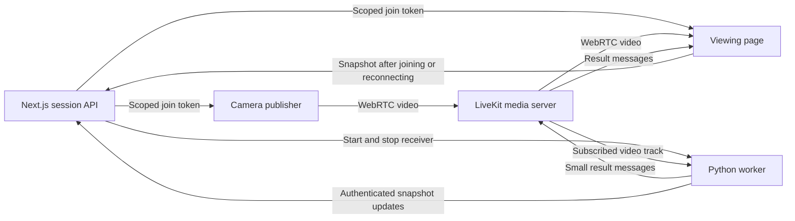

# FightLens live camera and WebRTC specification

Version 0.1 · Draft for review · October 9, 2026

Implementation note: the local capture, pairing, transport, and diagnostic receiver now exist. See [setup](LIVE_SETUP.md) and [verification evidence](LIVE_VERIFICATION.md). Physical-phone/network acceptance and delivery C remain outstanding; this draft remains the design reference.

The pose-only analysis adapter and annotated video return are now implemented; see [LIVE_YOLO.md](LIVE_YOLO.md). Full contact verification, Jev, and numerical momentum remain outstanding.

FightLens will capture a phone or desktop camera, stream the video through WebRTC, and deliver the same published track to the viewing page and a Python analysis worker. The first delivery proves camera capture, media delivery, and result delivery before integrating the MMA models.

This specification extends [the product requirements](PRD.md) for live input. The existing Next.js application provides local file playback and a simulated curve; camera capture, LiveKit, session APIs, and a live receiver are proposed here. The broader analysis and evidence replay requirements remain in the PRD.

## Scope and decisions

| Item | Decision |
| --- | --- |
| Input | One camera publisher per session, from a phone or desktop browser |
| Viewing | One primary viewing browser; publishing and viewing can share a desktop |
| Capture | Video only, initially requesting 720p at approximately 30 FPS |
| Recording | No permanent recording, full-session download, or browser MediaRecorder upload |
| Frontend | Existing Next.js, React, TypeScript, shadcn/ui Neutral theme, and Recharts |
| Media transport | Proposed LiveKit room with a published camera track |
| Analysis receiver | Python LiveKit RTC SDK; explicit frame consumption and processing queues |
| Initial UI | Video, connection and analysis status, and the momentum area; no recent exchanges panel |
| Later work | Actual tracking, contact verification, Jev judgments, calibrated momentum policy, and evidence replay |

LiveKit hosting, concrete SDK versions, and clock correlation support on the target phones require review and implementation checks. This draft does not authorize provisioning a hosted service or purchasing infrastructure.

## Architecture and service responsibilities



Next.js serves the pages, creates sessions, pairs a publisher, issues scoped tokens, authorizes commands, and serves the latest session snapshot. It does not decode camera video or run vision inference in a Route Handler.

LiveKit carries media and handles its signaling and ICE negotiation. A room allows the viewing browser and worker to subscribe independently to the publisher's camera track. The backend worker uses `VideoStream` to consume decoded frames. This architecture uses the RTC SDK directly rather than a conversational agent's default video sampling. [Room connections](https://docs.livekit.io/intro/basics/connect/), [raw track processing](https://docs.livekit.io/transport/media/raw-tracks/)

The first demo runs one long-lived Next.js control process, one media server, and one Python worker process. Session metadata and bounded result snapshots may use a volatile registry. A control-process restart invalidates its sessions; startup must reconcile and close rooms from the previous application instance before admitting new sessions. A shared state store is required before deploying multiple control instances or relying on stateless serverless execution.

## User flows and pages

### Start on a desktop

1. Open `/`, create a session, and choose **This device** or **Connect phone**.
2. **This device** opens the capture controls alongside the viewing area. **Connect phone** shows an expiring QR code and link for `/sessions/{id}/publish`.
3. The publisher selects **Enable camera** and grants browser permission. A local preview appears without publishing media.
4. The publisher checks framing, then selects **Start live**. The application reserves the publisher, starts the receiver, connects to LiveKit, and publishes the camera track.
5. The viewer attaches the remote track. The worker reports its first decoded frame. The UI distinguishes these two acknowledgments.

For the desktop flow, the received track is the authoritative viewing image after connection. If the initial SDK implementation cannot subscribe to its own publication in the same room connection, use a separate subscribe-only connection for the viewer. The local preview remains a framing aid and cannot prove backend delivery.

### Start on a phone

The phone may redeem a desktop pairing link or create its own session. The publisher page provides camera preview, front/rear camera selection, capture status, and **Start live / Stop live** controls. Prefer the rear camera for filming a match. A phone can also open the viewing page, with video above the momentum area.

The camera preview uses inline playback and is muted. The first support target is foreground use on iOS Safari and Android Chrome. Locking the screen, moving to the background, switching networks, and receiving interruptions are explicit device tests; continuous background capture is outside the first support contract.

### Controls and layout

Desktop uses video and analysis side by side where space permits. Narrow screens stack them, work at 320px width, and use touch targets of at least 44px. Preserve keyboard access, visible focus, and the existing Neutral theme.

**Pause analysis** leaves the camera stream and viewer running, stops new model work, and marks the paused interval. **Stop live** ends the session, releases the publishing camera, closes media participation, and stops new worker input. A viewer leaving the page does not stop the publisher. Resuming after **Stop live** creates a new session rather than reviving the ended one.

A live track has no seekable history. The file-player timeline and play/pause controls must not be presented as live seek controls. Historical video playback remains a later feature backed by a separate evidence buffer.

## Capture and transport requirements

Capture starts only from an explicit user action. Use `getUserMedia()` with `audio: false`, ideal width 1280, ideal height 720, and ideal frame rate 30. Phone capture prefers `facingMode: environment`; desktop capture supports a selected `deviceId`. Report actual settings rather than assuming the requested resolution or FPS was obtained.

The deployed page must use trusted HTTPS. Desktop development may use localhost; a phone opening a computer's ordinary HTTP LAN address is not a supported camera entry point. Report denied permission, missing camera, occupied device, and unsupported constraints separately. [Camera API requirements](https://developer.mozilla.org/en-US/docs/Web/API/MediaDevices/getUserMedia)

Attach the acquired track to the local preview, then publish that same track through LiveKit. Use browser/SDK codec negotiation and report the negotiated codec. Do not force a codec before desktop and phone interoperability has been tested.

For the first demo, avoid multiple simulcast layers unless needed by the tested devices. The worker must receive the intended analysis resolution and cadence; viewer bandwidth adaptation must not silently reduce the worker to an unsuitable track quality. Measure both subscriptions independently.

Switching cameras stops the previous capture track and acquires a new one. It creates a new video segment, invalidates old pending analysis, and requires framing and A/B identity confirmation again. Rotation that changes the interpretation of the image also starts a new segment. Stopping or abandoning capture must stop every owned media track and remove its preview reference.

Configure direct media connectivity and TURN fallback. A valid HTTPS page or signaling connection is insufficient evidence of a working media path. For self-hosting, expose the configured media ports and set up TURN certificates and routing. Test direct and relayed connections independently. [LiveKit network requirements](https://docs.livekit.io/transport/self-hosting/ports-firewall/)

## Session control and authorization

The session API is the authority for the owner, current publisher, active source generation, and terminal state. Use opaque IDs in rooms and participant identities.

| Role | Allowed actions |
| --- | --- |
| Owner | Pair a publisher, view, pause/resume analysis, and end the session |
| Publisher | Publish one video camera track; stop its session |
| Viewer | Subscribe to video and receive results; cannot publish or stop the session |
| Worker | Subscribe to the authorized camera track and publish analysis/status data |

Browser tokens must not grant room administration, recording, or server API access. Publisher tokens allow camera media only and no analysis-data publication. Viewer tokens allow subscription only. Worker room tokens allow subscription and result data, with server credentials kept outside browser code. Apply explicit grants rather than relying on SDK defaults. [Token grants](https://docs.livekit.io/frontends/reference/tokens-grants/)

Proposed pairing defaults are a single-use 5-minute publisher invitation and a 2-minute initial join-token lifetime. Pairing secrets use a URL fragment, are redeemed by POST, and are removed from the displayed URL. The server exchanges them for a scoped application credential. Owner and device credentials use HttpOnly secure cookies; state-changing browser requests check the origin. Join responses are not cached, and tokens and pairing secrets are excluded from logs.

Redeeming an invitation atomically binds the publisher. A second publisher receives a conflict; it cannot silently replace the first. The owner must explicitly end the current source before pairing another. Any delayed result must still match the active source generation.

Token expiry is not a session stop mechanism. LiveKit refreshes connected clients' tokens, and initial expiry does not terminate a running connection. Self-hosted removal also does not revoke cached tokens. Ending a session must stop issuing tokens, close the room, terminate worker acceptance, and disable application reconnect. Hosting review must resolve cached-token rejoin behavior; a recreated old room must never resume accepted analysis or appear as an active application session. Immediate media-access revocation requires a verified hosting-specific mechanism. [Token lifecycle and revocation](https://docs.livekit.io/frontends/reference/tokens-grants/)

## Connection and analysis states

Represent capture, transport, viewer, and analysis as separate states. A connected room or local preview cannot set all of them to ready.

| Domain | States and evidence |
| --- | --- |
| Capture | `idle`, `requesting`, `preview`, `failed`, `released` |
| Publisher transport | `idle`, `connecting`, `publishing`, `reconnecting`, `ended`, `failed` |
| Viewer | `waiting`, `receiving`, `stalled`, `ended`; receiving requires decoded video advancement |
| Worker input | `waiting`, `receiving`, `stalled`, `ended`; receiving requires decoded worker frames |
| Analysis | `diagnostic_only`, `initializing`, `ready`, `paused`, `overloaded`, `failed`, `ended` |

Proposed thresholds: first-frame timeout after 10 seconds; stale frame/status after 2 seconds; reconnect attempt window of 15 seconds. These are configurable demo defaults to validate, not measured performance. After the reconnect window, require **Retry connection**; do not override an explicit stop or server removal.

A stale heartbeat must clear a displayed ready state even if the last successful status remains in the snapshot. For initial demo operation, workers renew an active-session lease every 2 seconds; absence of authoritative permission for 5 seconds stops input acceptance and result publication until control is re-established.

SDK recovery may resume an interrupted connection while the session remains active. A republished track, receiver restart, timestamp discontinuity, or camera change creates a new `segment_id`. Source replacement also increments `source_generation`. Preserve history and insert gaps; do not connect the curve across missing evidence.

## Worker processing and temporary buffers

The worker subscribes only to the authorized publisher's camera track. Each decoded frame is associated with session, publisher, track, source generation, segment, and frame time. Unrecognized tracks cannot enter the analysis pipeline.

The receive loop must drain media independently of model execution. The initial diagnostic receiver retains at most two pending raw frames, reports dropped frames, and holds no historical video buffer. A separate executor or process runs blocking vision work. Keep at most one active model request and one waiting request initially; merge compatible evidence windows or mark an overload gap instead of allowing an unbounded queue.

The model adapter must distinguish tracking cadence from asynchronous clip verification. Targeting a 30 FPS input does not mean issuing 30 model requests per second. When clip-based analysis is introduced, its evidence buffer needs a separate, bounded memory and retention policy. The PRD's proposed 60-second replay buffer is a later delivery and is not implemented by this transport milestone.

For the initial delivery, diagnostic results contain actual received resolution, codec where available, FPS, frame count, last frame time, queue depth, drops, and processing duration. They must not generate inferred strikes or numeric momentum.

## Time and result contract

Use a versioned live-session envelope around future analysis payloads. This does not silently change the existing event JSON contract in the README; integrating those payloads requires an explicit adapter and schema review.

Every envelope contains `schema_version`, `session_id`, `source_generation`, `segment_id`, `track_id`, `worker_generation`, `seq`, `kind`, and `provenance`. Sequence numbers increase within one worker generation and segment. The control API issues worker generations so a restarted receiver cannot overwrite newer results with an old sequence.

Illustrative diagnostic message:

```json
{
  "schema_version": "fightlens.live.v1",
  "session_id": "session-example",
  "source_generation": 1,
  "segment_id": "segment-example",
  "track_id": "track-example",
  "worker_generation": 1,
  "seq": 42,
  "kind": "receiver_status",
  "provenance": "live_camera",
  "timing": {
    "basis": "receiver_monotonic",
    "received_position_ms": 12340,
    "processed_position_ms": 12100,
    "capture_wall_time_us": null,
    "clock_mapping_id": null
  },
  "frame_ref": {
    "publisher_frame_id": null,
    "receiver_frame_seq": 381
  },
  "analysis": {
    "mode": "diagnostic_only",
    "momentum": null,
    "model_version": null
  },
  "metrics": {
    "received_fps": 29.4,
    "width": 1280,
    "height": 720,
    "queue_depth": 1,
    "dropped_frames": 2
  }
}
```

These values illustrate the schema and are not measurements. The first worker frame anchors a segment's receiver-relative time. The diagnostic implementation can use elapsed monotonic receiver time, explicitly labeled as such. It must not call that capture time or claim frame-accurate synchronization with the viewer.

LiveKit documents optional capture timestamps and frame IDs, and a browser metadata lookup associated with rendered frames. Pin compatible SDK/server versions and probe actual support on each target browser before enabling that path. With validated metadata and a clock mapping, correlate worker results and rendered frames by the shared frame reference. Without it, display receiver-relative progress and mark viewer alignment unavailable. Do not fabricate a mapping from video `currentTime` or message arrival time. [Frame metadata](https://docs.livekit.io/transport/media/frame-metadata/)

Report separately:

- **Processing backlog:** latest received frame position minus processed position in the same segment and clock basis.
- **Worker processing duration:** measured with the worker's monotonic clock.
- **Capture-to-display latency:** available only with validated inter-device clock mapping and rendered-frame correlation, or an external measurement.

Future event results also require their event time, evidence cutoff, event/episode identity, revision, model/policy version, and valid or withdrawn state. The viewer records actual display time. Old generations and segments cannot update the current live signal; same-segment revisions replace the earlier version rather than adding another contribution.

## Result delivery and momentum behavior

The worker sends small JSON messages through LiveKit reliable data packets, with topics for receiver status and analysis updates. Keep each application packet below 8 KiB. The viewer accepts result messages only from the server-authorized worker identity, validates the envelope, and rejects stale generations and duplicate sequences. Receiver frame sequence is local to the worker; it cannot substitute for a shared publisher frame ID when correlating the viewer's rendered frames.

Reliable data packets are not a persistent event log and do not replay messages missed during disconnection. The worker first commits accepted updates to the control service's bounded snapshot, then emits the corresponding room message. On join, reconnect, or a sequence gap, fetch the snapshot and merge buffered newer messages by generation and sequence. A snapshot atomically includes its applied sequence and complete current state within the retained window. Data outside that window is explicitly expired. Status may refresh at 1 Hz; semantic results publish when they change. [Data packet delivery guarantees](https://docs.livekit.io/transport/data/packets/)

The live momentum area displays **Waiting for analysis** or **Numeric momentum unavailable** until a real, validated policy produces values. Diagnostic mode shows transport status, not a synthetic live prediction. The existing simulated curve remains available through an explicit **Demo** mode. Switching into a live session clears that demo signal. Missing coverage stays a gap, and late results are positioned at their evidence time while retaining their actual arrival/display time.

## Proposed API surface

Paths and payload schemas below are draft contracts. All session requests require a credential for that session; possession of a session ID alone grants no access.

| Endpoint | Purpose |
| --- | --- |
| `POST /api/sessions` | Create a session and owner credential; return publisher/view URLs |
| `POST /api/sessions/{id}/pairing` | Owner creates a one-use publisher invitation |
| `POST /api/sessions/{id}/redeem` | Exchange invitation for a publisher credential; bind its identity |
| `POST /api/sessions/{id}/join` | Issue a role-scoped token; publisher join also authorizes an active source and starts its worker |
| `GET /api/sessions/{id}` | Return authoritative state, source/worker identities, latest status, and bounded result snapshot |
| `POST /api/sessions/{id}/analysis` | Owner requests pause or resume; response includes acknowledged state |
| `POST /api/sessions/{id}/stop` | Owner or publisher ends the session; repeated requests return the same terminal state |
| `POST /api/internal/sessions/{id}/updates` | Authenticated worker commits updates for its active generation |

Owner and publisher joins can also receive viewing permission for the same session. The first demo does not offer public viewing invitations. Internal updates must have service authentication and active-session checks; browser credentials cannot call them.

State-changing commands include a request ID. Retrying the same command must not create another session, consume another invitation, launch another worker, or allocate a new source generation. Invitations are consumed atomically. Return stable error codes for permission failure, expired invitation, publisher conflict, ended session, and unavailable media/worker service.

Stopping sets authoritative state to `ended` before cleanup. Reject new joins and updates immediately; stop the worker and close the media room with retryable cleanup. The UI distinguishes **Session ended** from **Media cleanup pending** if cleanup fails. The publisher stops local tracks immediately on its own stop action and upon receiving an owner-initiated end.

## Retention and deployment

Before publishing, disclose that video leaves the device and reaches the media and analysis services. Initial diagnostic frames are transient and released after consumption or replacement. No raw video, images, or full-session media files are written to disk by this milestone. Retain status and result metadata for at most 30 minutes after session end in the demo registry; process restart may remove it sooner.

Disable full-media recording and omit video payloads, tokens, pairing secrets, and camera images from logs. Future evidence buffers require an explicit duration, memory limit, expiry behavior, and user-facing disclosure before being enabled.

The deployment needs an HTTPS frontend/control origin, a reachable secure LiveKit signaling endpoint, tested direct and TURN media paths, and a continuously running Python receiver. Keep media administration and worker service credentials in server configuration. Hosted versus self-hosted LiveKit remains a review choice; this specification does not assume a provider account, domain, or TURN service has been provisioned.

## Delivery and acceptance

Complete each delivery before using the next one's outputs as proof. Targets below are proposed acceptance conditions, not benchmark results.

| Delivery | Acceptance |
| --- | --- |
| A — camera preview | Desktop camera and physical iOS/Android phone capture; device selection, denied permission, retry, inline preview, and track release work |
| B — media and diagnostic worker | Phone QR pairing reaches the desktop viewer and Python receiver; both identify the same authorized publication; actual FPS/resolution and worker timestamps reach the UI |
| C — analysis adapter | Real model outputs use the envelope and current source/segment; paused, skipped, late, revised, and unavailable results behave according to the PRD |

For delivery B, run each core scenario for at least 120 seconds: desktop publish/view on one computer, iPhone Safari to desktop, and Android Chrome to desktop. Record OS/browser/SDK versions, connection setup time, actual codec/resolution/FPS, worker queue depth, memory use, and all gaps. On an uncongested test network, propose a minimum sustained diagnostic receive rate of 20 FPS at the negotiated 720p target; failure reports the actual rate and blocks claims of suitable input for rapid strike analysis. Stable bounded memory is required.

Also verify:

- 320px portrait and phone landscape layouts, keyboard navigation, and touch controls.
- Same-network and cellular-to-desktop streaming, plus a deliberately forced TURN relay verified through connection statistics.
- Network interruption, stale video, worker failure, and reconnect; gaps appear, and old results cannot contaminate the new segment.
- Camera switching and receiver restart; framing/identity confirmation resets where required.
- Duplicate or expired pairing, concurrent publisher joins, and viewer attempts to publish/control a session.
- Viewer departure leaves publishing active; publisher or owner stop releases the camera and prevents accepted analysis from resuming.
- Repeated start/stop requests and cleanup failures do not duplicate workers or revive ended sessions.
- Dropped data messages and joining after the worker starts recover the latest state from the snapshot.
- Every live session has explicit diagnostic/real-analysis provenance; the simulated curve never appears as live model output.

Browser emulation is sufficient for layout checks only. Camera support, background behavior, media quality, and TURN fallback require physical devices and actual networks. Model accuracy and the PRD's inference latency targets are separate from delivery B's transport acceptance.

## Review decisions

| Decision | Proposed position |
| --- | --- |
| Media implementation | LiveKit RTC SDK and Python receiver; retain aiortc as a fallback for a single-device experiment |
| Hosting | Choose hosted or self-hosted LiveKit before cross-network implementation; verify termination/rejoin semantics for that choice |
| Initial release | Deliver A and B first, with real transport diagnostics and no fabricated momentum |
| Time correlation | Probe optional frame metadata on target SDK/browser versions; expose receiver-relative timing until validated |
| Replay | Defer the PRD's 60-second evidence playback to a separate bounded-retention implementation |

These decisions can be reviewed independently of the model and numerical momentum design.
