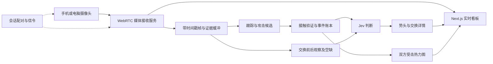

# FightLens 产品需求文档

- 版本：v0.4（中文精简版）
- 日期：2026-10-09
- 产品形态：Next.js Web App，适配电脑与手机。
- 视频输入：手机或电脑摄像头，通过 WebRTC 实时直播。
- 状态：产品设计；现有演示使用模拟曲线，摄像头直播、自动分析、数值势头与延迟指标仍需验证。

## 1. 产品目标与范围

FightLens 帮助用户看懂一次站立攻防：**谁攻击了谁、是否命中、命中哪里，以及新证据偏向哪一方**。主界面由直播视频、势头曲线、双方受击热力图和证据回放组成。

首版支持一个摄像头发布端、一个观看端及后端分析。手机可以扫码开播，电脑观看；也可以在同一电脑上使用摄像头与看板，但仍需验证 WebRTC 接收链路。

| 阶段 | 交付内容 |
| --- | --- |
| MVP A | 摄像头直播、稳定 A/B 身份、攻击事件与结果、Jev 交换判断、曲线与热力图联动、修订及回放 |
| MVP B | 有对应市场时，研究判断显示之后的价格变化与交易成本；独立于 MVP A |

本版不覆盖完整裁判评分、胜率预测、医学伤害或力量估计、完整地面缠斗与降服识别、自动交易，以及 YouTube 输入、Chrome 插件、大规模观众和多机位直播。阶段状态保留站立／缠抱／地面／未知；超出能力时显示无法评估。

## 2. 使用流程与 UI/UX

### 开播与连接

1. 创建会话，选择「本机摄像头」或「连接手机」。手机通过会话二维码或链接进入发布页，也可直接创建会话。
2. 点击「开启摄像头」，授权并选择前后摄像头或电脑 webcam。先显示本地预览，建议稳定横屏、双方全身入镜。
3. 点击「开始直播」后建立 WebRTC 连接。区分本地预览、连接成功、收到画面和分析就绪，预览不代表视频已送达后端。
4. 在接收画面上手动确认 A/B，可设置回合开始时间；未设置时显示会话媒体时间。身份随选手移动，不能以屏幕左右判断。
5. 实时看板展示视频位置、已处理位置与分析延迟。点击事件或拖动时间轴进入回看，实时接收和分析继续；「返回实时」恢复最新画面与分析位置。
6. 「暂停分析」仅暂停新推理并标记空缺；「停止直播」由发布者或会话所有者执行，停止传输、释放摄像头并停止新分析输入。观众离开不自动停播。

清空会话先结束直播，再清除明确说明的本地记录；远端数据按声明的保留策略处理。已主动结束的会话不能被自动重连恢复。

### 页面布局

- **发布页**：摄像头预览、设备选择、取景提示、连接状态和醒目的开播／停播按钮。
- **电脑看板**：主区域放直播视频，旁边放分析；手机依次排列视频、势头曲线、时间轴、双方热力图和事件详情。
- **分析区**：会话与 A/B 状态 → 当前势头及曲线 → 共享时间轴 → 双方受击图 → 可展开的交换证据。
- 视频为视觉主体，图表不遮挡选手和控制按钮。骨架与检测框仅放在可选诊断视图。市场研究通过独立入口进入。
- 320px 宽度下无横向滚动，支持手机横竖屏、键盘操作和可见焦点；颜色同时配文字，不依赖悬停，尊重减少动态效果设置。

### 势头曲线

曲线表达**近期可评估交换证据的方向**：正值偏向 A，负值偏向 B，零值表示定义范围内的平衡。它不表示胜率、裁判比分或伤害。

- 使用 Recharts；保留零基线、清晰 A/B 标签、事件标记及最新有效结果点。时间范围按实际数据提供。
- 事件更新后保持数值时可用阶梯线；采用持续衰减指标时使用连续线。插值方式必须符合计算定义，不能提前使用未来证据。
- 数值策略需明确窗口／衰减、贡献权重、归一化、覆盖要求、无动作及空缺处理，并记录版本和贡献的交换修订。
- 数值策略验证前，真实会话显示分类方向和「数值势头暂不可用」；模拟曲线持续标记 Demo，并保持与真实分析的来源区别。
- 身份不明、遮挡、超出能力或关键证据不足时显示断点／空缺，不能补零或跨空缺平滑连线。模型置信度不能直接变成势头强度。
- 标记位于事件发生时间；判断到达后才能更新。保留其实际显示时间，并在延迟更新或修订时提示。

### 受击热力图与联动

- 两个人体轮廓标注「A 被 B 命中」「B 被 A 命中」，按头、躯干、腿分区，显示准确次数。
- 热度表示确认受击次数，不表示伤害或精确解剖位置。双方使用相同色阶；回看时固定范围，直播溢出时统一调整并提示。
- 默认累计本回合已接收区间至共享游标；中途开播需标注实际覆盖范围，空缺不等于零次攻击。
- 仅 `accepted + landed` 且防守者、部位明确的事件贡献热度，按 `event_id` 去重。格挡、未命中、未知、待确认不计入；无法归属的接触单独显示。
- 修订、撤回或身份更正须移除旧贡献后重算。反复前后拖动结果一致，不能重复累加。
- 曲线、热力图、事件和证据共用时间游标。悬停临时预览，移开恢复固定时间；点击、触摸或键盘固定位置。选中身体区域展示该区间的对应事件。
- 累计受击与近期势头口径不同；受击较多的一方也可能刚刚取得主动。

### 证据与异常状态

交换详情显示：事件时间、证据截止时间、方向、证据类型、具体观察、限制、待确认／已更新／已撤回状态和回放入口。说明由观察记录与固定文案生成。

WebRTC 直播流本身不可历史拖动；回放使用独立缓冲片段，初始目标为可配置的 60 秒滚动缓冲。回放不暂停发布或进入实时分析；片段过期时显示「证据不可用」。依赖后续画面的判断，在选中时将游标移到该修订的证据截止时间；更早位置仅展示当时证据支持的内容。

| 状态 | 界面行为 |
| --- | --- |
| 无权限、无摄像头或设备占用 | 说明原因，提供重试／设备选择 |
| 正在连接、等待画面、初始化分析 | 分别显示，不将连接成功等同于分析可用 |
| 接触事件已确认、交换判断待返回 | 热力图可更新，势头区标记待确认 |
| 画面停滞、断线、手机锁屏／后台 | 标记中断与空缺，保留历史；恢复能力按设备验证 |
| 切换摄像头、旋转或时间戳重置 | 复核取景、身份和时间；必要时建立新视频分段 |
| 正在回看 | 固定选择，直播继续，提供返回实时 |
| 分析超时或过载 | 保留确认事件，说明延迟／跳过区间，不复用旧判断 |
| 新回合、重连或发布源更换 | 分段、去重，旧来源结果不能写入新来源 |

## 3. 技术与数据链路

Next.js 负责页面与会话 API；摄像头、WebRTC 生命周期和图表交互使用 Client Components。媒体接收、信令、TURN 中继和视觉推理需单独部署或接入，不能假设 Next.js 已提供。

- 摄像头使用 `getUserMedia()`，部署需 HTTPS；本机开发可用 localhost，手机访问电脑的普通 HTTP 局域网地址不作为摄像头方案。首版只请求视频。
- 信令交换 SDP 与 ICE，配置 STUN 与 TURN 回退，验证同网及跨网连接。接收服务必须将同一流送到看板和分析 worker，浏览器间能看视频不等于分析链路已打通。
- 初始建议 720p／约 30 FPS，按设备协商并报告实际接收质量。模糊、抖动、弱光、遮挡和低帧率影响评估时明确降级。
- 会话绑定发布者、所有者和观众权限；配对链接限时有效。替换发布源由所有者确认，后台凭据不进入浏览器。
- 视频会离开发布设备进入接收与分析服务，开播前说明处理及保留方式。滚动证据缓冲与永久录像分开；永久录像不属于首版必需功能。

现有模块接口见 [README 的事件合同](../README.md#event-json-contract)。直播会话与时间字段是后续接口设计要求，需通过合同版本变更统一接入，不在本 PR 修改已有模块合同。

## 4. Jev 判断与证据质量

Jev 仅接收匿名 A/B 的视觉事实：当前阶段及能力、交换前状态、双方攻击与反应、遮挡／丢帧／待确认项和证据截止时间。赔率、排名、战绩、解说与前次判断不进入核心输入。

初始窗口为交换前约 3–5 秒、交换过程及已到达的后续约 0.5–2 秒，按准确率和延迟调整。每次修订只能使用届时已接收的画面；接触与随后反应分别记录，时间相近不自动证明因果。保留双方反击，不以单次接触判定整个交换。

两个问题独立评估同一证据：

| 问题 | 输出 |
| --- | --- |
| 新证据偏向谁 | `favors_A`、`favors_B`、`no_clear_advantage`、`insufficient_evidence` |
| 支持什么观察 | `contact_only`、`observable_reaction`、`sustained_change`、`no_confirmed_effect`、`insufficient_evidence` |

证据类型不是严重程度排名。只有格挡／未命中且覆盖充分时，可返回无明确效果；证据不足则无法评估。接触事实不能推断力量、伤害或明显局势变化。反应能力未启用时不能展示自动识别的反应／持续变化；人工注释需标明来源。

应用层约束：身份不明、关键场景超出能力、可能改变方向的未知反击或合法性未明的疑似犯规，均抑制强方向提示。超时或无效响应保留待确认状态。保存模型完整分布及置信度，但未校准前不展示为准确率、胜率或价格上涨概率。

状态区分 `not_assessed`（未执行）、`unknown`（执行但无法判断）、`observed`（已有证据）、`no_clear_effect_observed`（指定窗口未见明确反应）。未执行检查不能用空数组表示“没有问题”。

## 5. 时间、修订与回放

事件按 `event_id` 替换；交换按 `episode_id + revision` 更新。统一账本驱动曲线和热力图，重复记录及过期响应不能覆盖新版本。

每项记录保留会话／视频分段、发布源代次、帧标识、来源、媒体时间、证据截止时间、模型及模板版本、请求返回时间、判断就绪和实际显示时间。来源区分实时摄像头、录制片段、人工注释和模拟数据。

WebRTC 媒体时间映射到会话时间；回合可人工锚定。RTP 时间和播放器 `currentTime` 不直接视为墙钟。记录采集、接收、呈现和分析各阶段的时钟映射；无法建立采集端时间时，仅报告接收端相对延迟。

回看可显示截止游标时刻的最新有效修订，并标注后续更正；不能使用游标之后的反应画面。另存最初实际展示的版本，供延迟与市场研究，禁止以事后更正冒充当时信号。

## 6. 验收与交付顺序

指标均为初始目标，需报告原始计数、样本范围与失败情况。界面模拟、直播传输和真实模型输出分别验收。

| 项目 | 初始验收要求 |
| --- | --- |
| 摄像头直播 | 电脑 webcam、手机扫码到电脑均实测；验证权限错误、直接连接、TURN 回退、断线、换机位及停播释放摄像头 |
| 视频与分析 | 同一流到达看板和 worker，帧／时间可关联；持续运行并记录 FPS、分辨率、空缺及资源占用 |
| 视觉事件 | 清晰站立片段无 A/B 交换；候选召回 ≥95%；联合命中精确率 ≥90%、召回 ≥70%；报告未知、重复、超时和混淆 |
| Jev | 至少 3 个独立片段、30 次交换；双人标注并保留分歧；明确可评估样本的方向精确率目标 ≥90%，同时报告覆盖与弃权率 |
| UI/UX | 共享游标同步、回看固定、修订去重、相同色阶；320px 可用，键盘／触摸可操作，模拟与空缺明确 |
| 延迟 | 接收帧至叠加 P95 ≤200ms；接触至事件显示 P95 ≤2s，后者需采集时钟映射或外部测量；额外 Jev 延迟另测 |

直播呈现延迟与分析延迟分开，分段报告编码、网络、解码、排队、观察等待、推理及显示的 P50／P95／最大值。阈值和窗口在评测前固定，不能以少量片段宣称普遍可靠。

交付顺序：

1. Next.js 发布页与看板，用标记清楚的模拟数据完成联动。
2. 摄像头、扫码配对、信令、WebRTC 接收及 TURN 跨网验证。
3. 接收帧接入跟踪，先验证 10 秒，再验证 30–60 秒片段；建立账本与回放缓冲。
4. 人工证据验证 Jev，再接自动接触、反应识别与修订流。
5. 固定并验证数值势头策略，验收真实端到端链路与延迟。
6. 有对应市场且时钟可对齐时，开展 MVP B。

待确认：媒体接收／信令／TURN 服务、实际支持的手机与浏览器、证据保留成本、数值势头策略和告警阈值。已有 [PIPELINE.md](PIPELINE.md) 保留基础视觉验证方案；直播输入与交互以本 PRD 为准。

## 7. 后续市场研究

仅针对有对应市场且数据同步的比赛。记录合约与 A/B 映射、买卖报价、深度、费用和时间；摄像头演示没有对应市场时不做该实验。

从 `decision_ready_at` 开始，研究用户可见信号时使用 `displayed_at`；预先固定 5／15／30 秒窗口。模拟买入用当时可执行 ask，退出用 bid，计入滑点和手续费；缺报价、暂停、深度不足或无法退出单列。

同一交换的修订不是独立机会；按整场比赛拆分调参与评测，比较市场基线、简单接触方向规则与 Jev 增量。事件判断正确、价格方向正确和成本后盈利分别报告。「未发现增量价值」也可作为结果；不要求盈利、不执行自动交易。

## 8. 参考资料

- [基础视觉流水线与验证](PIPELINE.md)
- [Next.js 组件边界](https://nextjs.org/docs/app/getting-started/server-and-client-components)
- [摄像头 API](https://developer.mozilla.org/en-US/docs/Web/API/MediaDevices/getUserMedia)、[WebRTC 连接](https://webrtc.org/getting-started/peer-connections)、[信令](https://developer.mozilla.org/en-US/docs/Web/API/WebRTC_API/Signaling_and_video_calling)
- [TypeSafe 原语](https://docs.typesafe.ai/introduction)、[置信度定义](https://docs.typesafe.ai/confidence)
- [ABC MMA 评分说明](https://www.abcboxing.com/wp-content/uploads/2025/08/ABC-MMA-Scoring-Criteira-Clarification-7.2025.pdf)
- [赛事元数据候选接口](https://developer.sportradar.com/mma/reference/mma-sport-event-summary)
- [Polymarket 费用](https://docs.polymarket.com/trading/fees)、[结算规则](https://help.polymarket.com/en/articles/13364518-how-are-prediction-markets-resolved)
