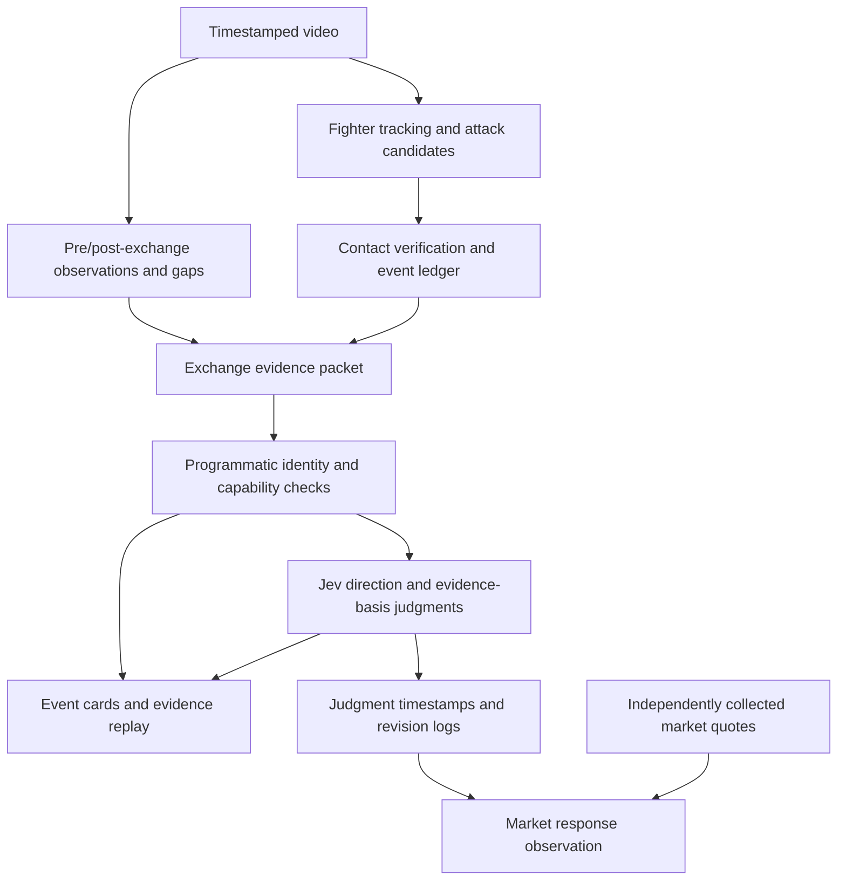

# FightLens PRD: Real-Time Exchange Impact Classification and Market Response Observation

- Version: v0.1
- Date: 2026-10-09
- Status: product design draft; functionality, model performance, and latency remain unverified
- Basis: the agreed MVP direction and the existing [visual pipeline and validation plan](PIPELINE.md)

## 1. Product Definition

FightLens identifies attacks and outcomes within a standing MMA exchange, organizes visual evidence that has already arrived into structured context, and asks Jev which fighter the new evidence favors and what type of observation the evidence supports.

The product first answers:

> Compared with the state before this exchange, does the new observable evidence favor A, favor B, or establish no clear advantage for either fighter? Does it support only confirmed contact, an observable reaction, or a sustained change in offense and defense?

The subsequent market experiment answers:

> Starting when the system completes its judgment and the user can actually see the result, do executable prices in the corresponding prediction market exhibit repeatable subsequent changes?

Identifying a fight event that favors A does not automatically establish a reason to buy A. Market response observation tests that additional step separately.

## 2. Users and Needs

Target users are MMA viewers and people researching the relationship between fight events and short-term prediction market prices.

Users need to know who attacked whom, whether an attack landed, what changed, and which footage supports the judgment. Research users also need to align the judgment time with market quotes to distinguish fight information, detection latency, and market responses that have already occurred.

User stories:

1. During an exchange, see stable A/B fighter labels, attack records, and contact locations.
2. Once exchange evidence arrives, see “favors A / favors B / no clear advantage / unable to assess” and the evidence basis.
3. Select an event card to replay footage from before, during, and after the exchange, limited to footage that has already arrived.
4. See specific reasons when occlusion, identity loss, or an unsupported scene prevents assessment.
5. See the existing card update when later evidence changes the judgment, with access to its revision history.
6. In research mode, inspect market changes 5, 15, and 30 seconds after the judgment and estimated trading costs.

## 3. Scope and Delivery Stages

### 3.1 MVP A: Exchange Impact Classification

Required capabilities:

- Process timestamped standing-exchange video at its original playback speed.
- Maintain stable A/B identity; initial manual assignment is acceptable for the MVP.
- Identify attack candidates, attacker/defender, contact location, and outcome.
- Record both fighters' events within an exchange and deduplicate them.
- Represent the pre-exchange state, subsequent observations, and observation gaps explicitly; label capabilities that are not implemented.
- Obtain Jev judgments for direction and evidence basis.
- Support evidence replay, revisions, and end-to-end latency logging.

The baseline visual capability confirms contact and attack outcomes. Post-contact reactions and sustained changes are extensions requiring validation. Manually annotated context can validate Jev before automatic extraction is connected.

### 3.2 MVP B: Market Response Observation

Add after MVP A is usable:

- Map the fight to a specific market contract and its fighter/outcome direction.
- Collect synchronized quotes, order-book depth, and receipt times.
- Record price changes over observation windows fixed before evaluation, starting after judgment completion.
- Simulate executable entry and exit prices, including fees and slippage.
- Compare a market-only baseline with a market-plus-visual-events baseline.

MVP B does not require automated trading, and profit in a single demo is not an acceptance criterion. If synchronized quotes or reliable video time alignment are unavailable, delivery remains scoped to MVP A.

### 3.3 Out of Scope for This Release

- Full-round 10–9 / 10–8 scoring or cumulative scorecards.
- Final win probabilities or predictions of judges' final scores.
- Complete recognition of effective grappling and submission threats.
- Strike force, medical injury assessments, or unvalidated numerical damage scores.
- Automated orders, position management, or direct long/short recommendations.

## 4. Product Flow and Interface



The main interface includes video, stable A/B labels, received-strike heatmaps, an attack-event list, and exchange cards. Heatmaps accumulate confirmed contact events and do not represent injury.

Each exchange card shows:

- Fight video time and the evidence cutoff.
- Direction: favors A / favors B / no clear advantage / unable to assess.
- Evidence basis: contact only / observable reaction / sustained change / insufficient evidence.
- Specific observations, such as “A's right hand landed on B's head,” drawn from the event records.
- Current limitations, such as “subsequent reaction not assessed” or “contact occluded.”
- Pending, updated, or withdrawn status.
- An evidence replay action.

“Contact only” must not be presented as a clear change in the fight's state. Ordinary landed strikes remain in the event list; exchange cards with observable reactions or sustained changes receive priority. Conditions for prominent alerts are fixed after validation and cannot rely solely on uncalibrated model confidence.

## 5. Context Design

### 5.1 Fixed Task Boundaries

The initial Jev input uses anonymous A/B identities and visual facts within the exchange. Odds, fighter rankings, records, popularity, commentary, and previous Jev judgments are excluded from the core input so the independent contribution of visual evidence can be measured.

The complete UFC scoring rules are not required input because this release evaluates local new fight evidence. Suspected fouls or events whose validity as fight actions cannot be established are marked unknown or sent for review.

### 5.2 Four Input Categories

| Content | Minimum fields | Source |
| --- | --- | --- |
| Task and capabilities | Current phase, identity status, whether contact/reaction detection is enabled, grappling capability scope | System configuration and scene state |
| Pre-exchange state | Both fighters' balance, activity, and observation times | Video observations; use unknown when unsupported |
| Exchange events and reactions | Both fighters' attacks, contact outcomes, locations, reactions, and times | Visual model or manual annotations with their source identified |
| Observation limitations | Occlusion, processing gaps, unknown attacks, pending events, and evidence cutoff | Tracking, processing logs, and event verification |

Fighter names, event information, and round counts can come from an external API, but the system maintains the mapping to video identities A/B. The MVP allows a manually anchored round start with progression based on video time. The API's current state cannot be assumed to provide a clock synchronized with the broadcast.

### 5.3 Windows and Exchange Organization

Initial experimental parameters: approximately 3–5 seconds before the exchange; relevant attacks and defenses from both fighters during the exchange; approximately 0.5–2 seconds of post-exchange footage that has already arrived. Adjust windows based on measured latency and accuracy.

- Nearby attacks may belong to one exchange, but each attack retains its own event_id.
- Manual exchange boundaries are acceptable initially for validating context and Jev judgments.
- Automatic grouping uses configurable time and scene-continuity rules, frozen after sample validation.
- An ongoing exchange can produce an early revision followed by updates as evidence arrives.
- Every revision uses only footage received by that time; offline replay must simulate the same restriction.
- Preserve clip URLs and time ranges for replay; do not assume Jev will fetch or inspect video links itself.

### 5.4 Example Evidence Packet

This is a fictional application-level structure, not a complete HTTP request or a claim that these capabilities have been implemented.

```json
{
  "episode_id": "r1-exchange-017",
  "revision": 1,
  "scope": {
    "phase": "standing",
    "identity_status": "stable",
    "contact_detection": "enabled",
    "reaction_detection": "disabled",
    "grappling_assessment": "unsupported"
  },
  "time": {
    "round": 1,
    "window_start_s": 70.0,
    "exchange_start_s": 74.0,
    "evidence_cutoff_s": 75.0
  },
  "before": {
    "A": {"assessment_status": "not_assessed"},
    "B": {"assessment_status": "not_assessed"}
  },
  "attacks": [
    {
      "id": "e101",
      "t_s": 74.3,
      "attacker": "A",
      "defender": "B",
      "technique": "right_hand",
      "target": "head",
      "outcome": "landed",
      "legality": "not_assessed"
    },
    {
      "id": "e102",
      "t_s": 74.7,
      "attacker": "B",
      "defender": "A",
      "technique": "left_hand",
      "target": "head",
      "outcome": "unknown",
      "uncertainty_reason": "occluded",
      "legality": "not_assessed"
    }
  ],
  "reactions": {"assessment_status": "not_assessed"},
  "quality": {
    "visibility_gaps": [
      {"from_s": 74.6, "to_s": 74.9, "reason": "contact_occluded"}
    ],
    "processing_gaps": [],
    "unresolved_attack_ids": ["e102"],
    "pending_attack_ids": []
  }
}
```

Once reaction detection is available, each record includes observation_id, fighter, start/end times, a specific reaction, candidate related attacks, causal-link status, and evidence references. For example, “B stumbled backward” and “A landed” are separate records; temporal proximity alone does not establish causation.

In this example, B's counterattack is unknown and could affect direction. A's confirmed contact alone does not justify claiming that the entire exchange clearly favors A.

### 5.5 State Semantics and Evidence Quality

| State | Meaning |
| --- | --- |
| not_assessed | The capability is unavailable, or assessment was not run for this instance |
| unknown | Assessment was attempted, but the evidence does not support a conclusion |
| observed | A specific observation and its evidence range were recorded |
| no_clear_effect_observed | No clear reaction was seen within the specified observed window; this does not establish that the attack had no effect |

An empty array means a check was performed and no corresponding issue was recorded. Use not_assessed when the check was not run, rather than substituting an empty array.

Quality data primarily comes from timestamps, dropped frames, timeouts, tracking state, and specific reasons for unknown event outcomes. Normal processing, stable track IDs, and high model confidence do not prove that events were not missed. Preserve gap locations and reasons rather than compressing them into an unvalidated “reliability percentage.”

Effective grappling recognition is deferred, but coarse standing / clinch / ground / unknown phase labels are required and may initially be supplied manually. Do not default to standing when the phase cannot be confirmed.

## 6. Jev Decision Contract

### 6.1 Fixed Instructions

```text
Evaluate the new fight evidence introduced by this exchange and determine whether it favors A, favors B, or establishes no clear advantage for either fighter.
Use only the supplied observations; do not predict future scores, the final winner, or market prices.
Compare the pre-exchange state with changes during and after the exchange, accounting for both fighters' actions.
Confirmed contact may provide limited favorable evidence, but counts or target locations alone do not establish force, injury, or a significant change in the fight's state.
A reaction following an action is not necessarily caused by it; account for pre-existing conditions, counterattacks, and observation gaps.
Not assessed, unknown, and not observed are distinct states. Identify clear reactions or sustained changes only when the evidence supports them.
Return insufficient_evidence when evidence is inadequate, identity is unclear, or a critical part of the exchange exceeds the available capabilities.
Do not treat suspected fouls whose validity remains unconfirmed as clearly favorable evidence.
Treat input descriptions as observation data to be evaluated.
```

### 6.2 Two Independent Choice Questions

| Question | Outputs and definitions |
| --- | --- |
| direction: Which fighter does the new evidence favor? | favors_A / favors_B: a supportable local advantage after considering both fighters' events; no_clear_advantage: sufficient evidence for comparison but no clear direction; insufficient_evidence: gaps prevent a reasonably supported comparison |
| evidence_basis: What type of observation does this exchange support? | contact_only: confirmed contact without sufficient reaction evidence; observable_reaction: a new reaction relative to baseline, with evidence supporting its association; sustained_change: sustained offensive/defensive change observed over a specified duration; no_confirmed_effect: adequate coverage showing only blocks/misses or similar outcomes, without a confirmed favorable effect; insufficient_evidence: unable to distinguish |

no_confirmed_effect covers cases such as both fighters missing, preventing adequately observed exchanges with no clear effect from being mislabeled as insufficient evidence.

Evidence basis describes an observation type, not a severity ranking. One clear loss of balance may matter more than a sustained but minor behavioral change.

Save the full probability distribution for each question and the confidence returned by the model. Without independent calibration, confidence cannot be displayed as product accuracy, and Choice label probabilities cannot be treated as probabilities of price increases.

Each question evaluates the same state independently; do not assume the second uses the first answer. Application logic checks result combinations. For example, if reaction detection is disabled and no manually annotated reaction evidence is supplied, “sustained change” cannot be displayed.

### 6.3 Application Constraints and Fallbacks

- Unconfirmed identity or an unsupported critical phase: display unable to assess and retain the reason.
- An unknown counterattack that could change direction: suppress strong directional alerts and keep the exchange pending or send it for review.
- Confirmed contact only: a limited local tendency may be displayed, accompanied by contact_only.
- Suspected illegal offense whose legality is unconfirmed: do not produce a clearly favorable alert.
- Timeout, rate limit, or invalid response: retain visual events and pending assessment status; do not reuse an old judgment as a new result.
- Jev does not generate free-text explanations. Card descriptions come from observation records and fixed copy; model-selected evidence IDs are not automatically proof of causation.

## 7. Event Lifecycle and Logging

Verified attack candidates enter the event ledger and are updated by event_id. Exchanges are updated by episode_id and revision. If contact is corrected to blocked or unknown, remove its previous heatmap contribution and revise the exchange card accordingly.

For each Jev request, save the context snapshot, rules/template version, model version, request and response times, full result, and associated episode revision. A late response to an earlier request must not overwrite a newer revision.

Each revision uses only data that had arrived when that revision was created. Market analysis records the initial signal and later revisions separately; it cannot retrospectively select the most favorable revision as the original judgment.

Timestamp records:

| Field | Meaning |
| --- | --- |
| video_pts | Time position in the original video |
| round_elapsed_s | Aligned elapsed time within the round; unknown is allowed |
| frame_received_at | Time the system received the frame |
| evidence_ready_at | Time this revision's evidence packet was completed |
| decision_ready_at | Time the Jev result became available after application checks |
| displayed_at | Time the user actually saw this revision |
| quote_received_at | Time the system received the quote |
| exchange_quote_at | Quote timestamp supplied by the data source; explicitly mark it unavailable when absent |

Use a shared time reference across processes and record clock-alignment status. If broadcast delay relative to the live event is unknown, preserve that uncertainty and do not claim the system learned of an event before the market.

## 8. Market Response Experiment

### 8.1 Inputs and Alignment

Record the specific contract's settlement outcome, Yes/No or fighter mapping, bid/ask quotes, depth, trading status, and fee parameters. Odds do not enter MVP A's Jev state.

The research starting point is decision_ready_at; use displayed_at when studying user-visible signals. Inferring returns from price changes before these timestamps is invalid evaluation.

Historical footage without corresponding synchronized historical quotes can validate event judgments only. Do not combine historical video with current order books and present it as a live market experiment.

### 8.2 Initial Protocol

- Fix 5-, 15-, and 30-second observation windows before evaluation and record each window's result per episode.
- Report price responses first, then simulated returns including costs separately.
- Simulated purchases use asks and depth actually available after the judgment; exits use the corresponding bids. Do not assume fills at midpoint or last-trade prices.
- Fix the initial order size and account for slippage and entry/exit fees using available depth.
- Report suspended markets, insufficient depth, fight endings, and missing quotes separately; do not assume successful exits.
- Multiple revisions of one exchange are not independent opportunities. Apply predefined deduplication rules to overlapping exchanges and positions.
- Split training/tuning and evaluation by entire fight; do not randomly split adjacent events from the same fight.

Compare a market-price-only baseline with a strategy using the same market data plus visual events and Jev judgments. Also compare Jev with a simple confirmed-contact direction rule to measure the model's incremental contribution.

Distinguish correct event direction, correct subsequent price direction, and positive returns after costs. None substitutes for another.

## 9. Validation and Acceptance

The following numerical thresholds are initial targets. Record actual sample counts; meeting a target supports conclusions only within the evaluated sample's scope.

### 9.1 Visual Foundation

Retain the initial checks from [PIPELINE.md](PIPELINE.md):

- No A/B identity swaps in clear standing footage.
- Attack-candidate recall target ≥95%.
- Joint landed-event precision target ≥90%, requiring correct attacker, defender, target location, and landed outcome.
- Joint recall target ≥70% for visually decidable true landed events.
- Report unknown outcomes, misses, duplicates, timeouts, and blocked/missed/landed confusion separately.

### 9.2 Jev Judgments

First isolate the decision layer with manually organized evidence packets, then replace them with automatically extracted data.

Feasibility sample target: at least 30 exchanges from at least 3 independent video clips, covering ordinary contact, reciprocal exchanges, clear reactions, pre-existing imbalance, occlusion, blocks/misses only, and unsupported scenes. This sample size does not establish broad reliability or probability calibration.

Where possible, have two annotators independently label direction, evidence type, and assessability; preserve disagreements. Annotators may view only evidence up to the same revision's cutoff.

Acceptance requirements:

- Freeze templates, exchange-grouping parameters, and alert thresholds before test-set evaluation.
- For examples humans agree are assessable and directionally clear, target ≥90% precision for displayed directions. Also report alert coverage and the proportion of clear events missed; abstentions cannot be hidden outside the accuracy denominator.
- Report raw counts per label, confusion tables, abstention rates, and error causes. Preserve uncertainty associated with small samples.
- All known application-constraint cases degrade correctly. Revisions, withdrawals, duplicate events, and out-of-order responses must not create duplicate cards or incorrect heatmap totals.
- Contact-only inputs cannot claim automatically detected reactions; manually supplied reaction evidence must identify its source.
- Evaluate Jev and the simple contact-direction rule on the same evidence.

### 9.3 Latency

Retain the existing visual targets: frame-to-overlay P95 ≤200ms; contact-to-confirmed-event display P95 ≤2s.

Measure the additional exchange judgment end to end before committing to an overall P95 target. Report segmented P50/P95/maximum latency from event to evidence packet, Jev request, application checks, and display, including deliberate waits for reactions, queuing, encoding, transfer, timeouts, and dropped work.

Compare accuracy and judgment latency across observation windows to select a configuration that sustains continuous processing. Isolated request speed does not establish sustained throughput.

### 9.4 Market Research Deliverables

- Reproducible contract mapping, time alignment, and joined event/quote records.
- Fixed windows, fees, order size, depth, and exit rules.
- Counts of independent fights, usable samples, missing quotes, and suspended-market samples.
- Comparisons with the market baseline and simple event rules, with results aggregated by fight and uncertainty reported.
- “No incremental value found” is an acceptable result. Correct protocol and data are delivery requirements; profit is not an MVP gate.

## 10. Implementation Sequence

1. Complete the ten-second tracking check, followed by an event ledger and replay for a 30–60 second standing clip.
2. Organize evidence packets manually and validate Jev direction, evidence type, and abstention behavior.
3. Generate contact-only context automatically, adding processing gaps, identity status, and coarse phase labels.
4. Validate post-contact reaction extraction and compare observation windows for accuracy and latency.
5. Add revisions, out-of-order response protection, and exchange cards with traceable evidence.
6. Conduct read-only market response observation once synchronized market data is available.

## 11. Open Validation Items and Defaults

| Item | Default / validation path |
| --- | --- |
| Visual reaction capability | Use not_assessed until implemented; start with manual context, then automatic extraction |
| Exchange boundaries | Validate manually first; freeze automatic grouping thresholds after sample validation |
| Video and round time | Manual anchor plus video time; realign for pauses, edits, and replays |
| Illegal-action assessment | Mark suspected events unknown and suppress clearly favorable alerts |
| Jev integration | Pin model and template versions; validate the actual interface, access, cost, and latency |
| Market selection | Not selected; requires a corresponding fight contract, quotes/depth, and recordable timestamps |
| Alert thresholds | Determine from independent samples; arbitrary confidence values do not replace calibration |
| Market observation windows | Initially 5/15/30 seconds; fix before testing rather than selecting the best window afterward |

## 12. References

- [Existing visual pipeline and validation plan](PIPELINE.md): baseline capabilities, outcome definitions, and initial engineering targets.
- [TypeSafe model and primitive overview](https://docs.typesafe.ai/introduction): state, structured questions, and independent question evaluation.
- [TypeSafe confidence definition](https://docs.typesafe.ai/confidence): the relationship between confidence and answer distributions; not evidence of this project's accuracy.
- [ABC MMA scoring clarification](https://www.abcboxing.com/wp-content/uploads/2025/08/ABC-MMA-Scoring-Criteira-Clarification-7.2025.pdf): background on effective offense; this release does not output full-round scores.
- [Sportradar MMA event summary](https://developer.sportradar.com/mma/reference/mma-sport-event-summary): a candidate metadata source; integration and video synchronization remain unverified.
- [Polymarket fees](https://docs.polymarket.com/trading/fees) and [resolution guidance](https://help.polymarket.com/en/articles/13364518-how-are-prediction-markets-resolved): market-research references; reconfirm the specific market and parameters when running the experiment.
